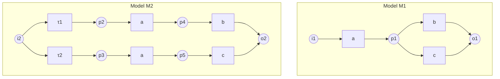

# Comparative Analysis: Imperative vs. Declarative Conformance Checking

This matrix compares Petri Nets / BPMN (imperative) with Declare / LTL (declarative) conformance checking methodologies under the v30.1.1 standard.

| Metric / Dimension | Imperative (Petri Nets, BPMN) | Declarative (Declare, LTL) |
|---|---|---|
| **Primary Focus** | Step-by-step path routing (how to execute) | Validation of boundary conditions (what to avoid) |
| **State representation** | Token marking configuration | Constraint evaluation vector |
| **Complexity of Join** | Constant time (vector addition / gate lookup) | Exponential in constraint count (SAT/Tableau) |
| **Lattice Boundedness** | Bounded (1-boundedness enforced) | Bounded (fixed constraint set size) |
| **Adaptability** | Rigid, requires rewriting model | Highly flexible, add/remove constraints easily |
| **Failure Resolution** | Alignment cost optimization | Constraint relaxation / exception pathways |

---

## 1. Mathematical Foundations of Imperative Conformance

Imperative conformance checking relies on a structural model that defines the exact pathways of execution.

### 1.1 Petri Nets and Workflow Nets
A **Petri Net** is defined as a tuple $N = (P, T, F)$, where:
- $P$ is a finite set of places representing states.
- $T$ is a finite set of transitions representing activities, with $P \cap T = \emptyset$.
- $F \subseteq (P \times T) \cup (T \times P)$ is the flow relation representing directed arcs.

A **Workflow Net (WF-net)** is a Petri net with:
1. A unique source place $i \in P$ such that ${}^{\bullet}i = \emptyset$.
2. A unique sink place $o \in P$ such that $o^{\bullet} = \emptyset$.
3. Weak path connectivity: every node $n \in P \cup T$ lies on a directed path from $i$ to $o$.

For details on Petri Net topology and properties, see [Petri Net Formalization](file:///Users/sac/process-intelligence/standards/petri-net.md).

### 1.2 P-Invariant Conservation Theorem
Let $C \in \mathbb{Z}^{|P| \times |T|}$ be the incidence matrix of the Petri Net. A vector $y \in \mathbb{Z}^{|P|}$ is a **P-invariant** if and only if:
$$y^T \cdot C = \vec{0}^T$$
The P-invariant conservation theorem states that for any reachable marking $M \in [M_0\rangle$:
$$y^T \cdot M = y^T \cdot M_0$$
This is proven using the Petri Net state equation:
$$M = M_0 + C \cdot \vec{x}$$
where $\vec{x} \in \mathbb{N}^{|T|}$ is the transition firing vector. Premultiplying both sides by $y^T$ yields:
$$y^T \cdot M = y^T \cdot (M_0 + C \cdot \vec{x}) = y^T \cdot M_0 + y^T \cdot C \cdot \vec{x} = y^T \cdot M_0 + \vec{0}^T \cdot \vec{x} = y^T \cdot M_0$$
This conservation law is a fundamental tool for proving structural properties such as place boundedness and token safety.

### 1.3 Soundness Criteria
A WF-net is **sound** if and only if:
1. **Option to Complete**: From any marking $M$ reachable from the initial marking $[i]$, the final marking $[o]$ is reachable:
   $$\forall M \in [N, [i]\rangle, \quad [o] \in [N, M\rangle$$
2. **Proper Completion**: If a marking $M$ reachable from $[i]$ contains a token in $o$, then no other places contain tokens:
   $$\forall M \in [N, [i]\rangle, \quad (M \ge [o]) \implies (M = [o])$$
3. **Liveness**: No transition is dead under the initial marking $[i]$:
   $$\forall t \in T, \quad \exists M \in [N, [i]\rangle \quad \text{such that } M \mathrel{[t\rangle}$$

For a complete breakdown of soundness verification algorithms, see [Workflow Net Verification Specification](file:///Users/sac/process-intelligence/standards/wf-net_verification_specification.md).

### 1.4 Alignment Cost Formulation
Let $\Sigma$ be the alphabet of activities, and let $\lambda: T \to \Sigma \cup \{\tau\}$ be a labeling function mapping transitions to activities (where $\tau$ represents silent transitions).
An alignment move is a pair $(t, a) \in (T \cup \{\gg\}) \times (\Sigma \cup \{\gg\}) \setminus \{(\gg, \gg)\}$, classified as:
- **Synchronous Move**: $(t, a)$ where $t \in T$, $a \in \Sigma$, and $\lambda(t) = a$.
- **Move on Log**: $(\gg, a)$ representing a process deviation where activity $a \in \Sigma$ occurs in the log but is not replayed in the model.
- **Move on Model**: $(t, \gg)$ representing a deviation where transition $t \in T$ is fired in the model but not observed in the log.

Let the cost function $c: ((T \cup \{\gg\}) \times (\Sigma \cup \{\gg\})) \to \mathbb{R}_{\ge 0}$ associate a non-negative cost with each move:
$$c(t, a) = \begin{cases} 0 & \text{if } t \in T, \, a \in \Sigma \text{ and } \lambda(t) = a \\ c_{\text{log}}(a) > 0 & \text{if } t = \gg \text{ and } a \in \Sigma \\ c_{\text{model}}(t) > 0 & \text{if } t \in T, \, a = \gg \text{ and } \lambda(t) \in \Sigma \\ 0 & \text{if } t \in T, \, a = \gg \text{ and } \lambda(t) = \tau \end{cases}$$

For a trace $\sigma \in \Sigma^*$ and a WF-net $N$, a valid alignment $\gamma$ is a sequence of moves whose projection onto the log yields $\sigma$ (denoted $\pi_{\text{log}}(\gamma) = \sigma$) and whose projection onto the model yields a valid transition sequence $\tau = \pi_{\text{model}}(\gamma) \in T^*$ from the initial marking $[i]$ to the final marking $[o]$ (i.e., $[i] \xrightarrow{\tau} [o]$).

The **Optimal Alignment** $\gamma^*$ minimizes the total deviation cost:
$$\gamma^* = \operatorname{arg\,min}_{\gamma \in \operatorname{Align}(\sigma, N)} \sum_{(t, a) \in \gamma} c(t, a)$$

For further implementation details and fitness/precision calculations, see [Slide-to-Replay Map](file:///Users/sac/process-intelligence/ma/define_slide-to-replay_map.md) and [Board-Admissible Claim Requirements](file:///Users/sac/process-intelligence/ma/define_board-admissible_claim_requirements.md).

---

## 2. Mathematical Foundations of Declarative Conformance

Declarative conformance checking defines boundary conditions (rules) that execution must satisfy, rather than explicit paths.

### 2.1 Declare and LTLf Semantics
Declare models specify templates mapped to Linear Temporal Logic over Finite Traces (LTLf). Let a trace be $\sigma = \langle e_1, e_2, \dots, e_n \rangle$ of length $n$. For an index $i \in \{1, \dots, n\}$ the satisfaction relation $\models$ is defined inductively as:
$$\begin{aligned}
\sigma, i \models a &\iff \operatorname{activity}(e_i) = a \\
\sigma, i \models \neg \varphi &\iff \sigma, i \not\models \varphi \\
\sigma, i \models \varphi \land \psi &\iff \sigma, i \models \varphi \text{ and } \sigma, i \models \psi \\
\sigma, i \models \mathbf{X} \varphi &\iff i < n \text{ and } \sigma, i+1 \models \varphi \\
\sigma, i \models \mathbf{F} \varphi &\iff \exists j \in \{i, \dots, n\} \text{ such that } \sigma, j \models \varphi \\
\sigma, i \models \mathbf{G} \varphi &\iff \forall j \in \{i, \dots, n\}, \, \sigma, j \models \varphi \\
\sigma, i \models \varphi \mathbin{\mathbf{U}} \psi &\iff \exists j \in \{i, \dots, n\} \text{ such that } (\sigma, j \models \psi \text{ and } \forall k \in \{i, \dots, j-1\}, \, \sigma, k \models \varphi)
\end{aligned}$$

The weak until operator $\mathbin{\mathbf{W}}$ is defined as:
$$\varphi \mathbin{\mathbf{W}} \psi \equiv (\varphi \mathbin{\mathbf{U}} \psi) \lor \mathbf{G} \varphi$$

Standard Declare templates and their LTLf formulas are detailed in [BPMN 2.0 to Declare Conformance Crosswalk](file:///Users/sac/process-intelligence/crosswalks/bpmn_to_declare_conformance.md) and [Declare Compliance Standard](file:///Users/sac/process-intelligence/standards/declare.md). The table below lists their LTLf specifications:

| Declare Template | LTLf Formula | Semantic Meaning |
|---|---|---|
| **Existence(A)** | $\mathbf{F} A$ | Activity $A$ must occur at least once in the trace. |
| **Absence(A)** | $\neg \mathbf{F} A \equiv \mathbf{G}(\neg A)$ | Activity $A$ must never occur in the trace. |
| **Responded Existence(A, B)** | $\mathbf{F} A \implies \mathbf{F} B$ | If $A$ occurs, $B$ must also occur (before or after $A$). |
| **Response(A, B)** | $\mathbf{G}(A \implies \mathbf{F} B)$ | If $A$ occurs, $B$ must occur eventually after $A$. |
| **Precedence(A, B)** | $\neg B \mathbin{\mathbf{W}} A$ | $B$ must not occur unless preceded by $A$. |
| **Succession(A, B)** | $\mathbf{G}(A \implies \mathbf{F} B) \land (\neg B \mathbin{\mathbf{W}} A)$ | $A$ occurs if and only if $B$ occurs afterward. |
| **Chain Response(A, B)** | $\mathbf{G}(A \implies \mathbf{X} B)$ | If $A$ occurs, $B$ must occur immediately next. |

### 2.2 Declarative Alignment Cost
For a Declare model consisting of LTLf constraints $\mathcal{D} = \{ \psi_1, \dots, \psi_k \}$, a trace $\sigma$ conforms if $\sigma \models \bigwedge_{j=1}^k \psi_j$. If $\sigma$ is non-conforming, the declarative alignment cost finds a conforming trace $\sigma^* \models \mathcal{D}$ that minimizes the Levenshtein distance (or weighted edit distance) to $\sigma$:
$$\sigma^* = \operatorname{arg\,min}_{\sigma' \models \mathcal{D}} \operatorname{dist}(\sigma, \sigma')$$
$$\operatorname{Cost}(\sigma, \mathcal{D}) = \operatorname{dist}(\sigma, \sigma^*)$$

This is solved by translating the LTLf formulas into a Deterministic Finite Automaton (DFA) $\mathcal{A}_{\mathcal{D}}$ representing the language of conforming traces, and executing an A* search on the product state space of the log trace and $\mathcal{A}_{\mathcal{D}}$.

---

## 3. Mathematical Verification of Alignment Cost Algorithms

This section proves the mathematical correctness, admissibility, and termination guarantees of the A* search algorithm used to solve the optimal alignment problem.

### 3.1 A* Search State Space
For a trace $\sigma = \langle a_1, \dots, a_n \rangle$ and a Petri Net with reachability graph $(S, T, \delta, s_0, S_f)$, the search space for A* is defined by states $u = (s, i) \in S \times \{0, \dots, n\}$, where:
- $s$ is the current marking of the model.
- $i$ is the number of events from $\sigma$ processed so far.
- The initial search node is $u_0 = (s_0, 0)$.
- The goal state set is $U_g = S_f \times \{n\}$.

The transition edges from state $(s, i)$ are:
1. **Synchronous Move**: $(s, i) \xrightarrow{(t, a_{i+1})} (s', i+1)$ if $s \xrightarrow{t} s'$ and $\lambda(t) = a_{i+1}$, with cost $c(t, a_{i+1}) = 0$.
2. **Move on Model**: $(s, i) \xrightarrow{(t, \gg)} (s', i)$ if $s \xrightarrow{t} s'$, with cost $c(t, \gg)$.
3. **Move on Log**: $(s, i) \xrightarrow{(\gg, a_{i+1})} (s, i+1)$, with cost $c(\gg, a_{i+1})$.

### 3.2 Heuristic Admissibility Proof
To guarantee that A* finds the optimal alignment without examining all paths, we must use an **admissible** heuristic function $h(s, i)$ that never overestimates the actual remaining cost to reach the goal set $U_g$.

Let $d_M(s)$ be the shortest model-path cost from marking $s$ to the final marking $s_f \in S_f$ using only model moves:
$$d_M(s) = \min_{t_1 \dots t_m \text{ s.t. } s \xrightarrow{t_1 \dots t_m} s_f} \sum_{k=1}^m c(t_k, \gg)$$

Let $\theta = \max_{t \in T} c(t, \gg)$ be the maximum cost of any single model move.
Let $\sigma_{\text{rem}}(i) = n - i$ be the number of remaining events in the log.

We define the heuristic function $h(s, i)$ as:
$$h(s, i) = \max\left(0, d_M(s) - (n - i) \cdot \theta\right)$$

#### Theorem (Heuristic Admissibility)
The heuristic function $h(s, i) = \max\left(0, d_M(s) - (n - i) \cdot \theta\right)$ is admissible, meaning for every state $(s, i)$, $h(s, i) \le d^*((s, i), U_g)$, where $d^*$ is the minimum cost of any alignment tail from $(s, i)$ to a goal state in $U_g$.

#### Proof
Let $\gamma_{\text{tail}}$ be any valid alignment tail from $(s, i)$ to some goal state $(s_f, n) \in U_g$. Let $N_{\text{log}}$ be the number of moves-on-log, $N_{\text{model}}$ be the number of moves-on-model, and $N_{\text{sync}}$ be the number of synchronous moves in $\gamma_{\text{tail}}$.

The remaining cost of the tail is:
$$\operatorname{Cost}(\gamma_{\text{tail}}) = \sum_{j=1}^{N_{\text{log}}} c(\gg, a'_j) + \sum_{k=1}^{N_{\text{model}}} c(t'_k, \gg)$$

Since the log index must advance from $i$ to $n$, the total number of log events processed in the tail is:
$$n - i = N_{\text{log}} + N_{\text{sync}} \implies N_{\text{log}} = (n - i) - N_{\text{sync}}$$

The model transitions fired in $\gamma_{\text{tail}}$ must transition the model marking from $s$ to $s_f$. The total cost of these transitions if they were all model moves is $\sum_{k=1}^{N_{\text{model}}} c(t'_k, \gg) + \sum_{j=1}^{N_{\text{sync}}} c(t''_j, \gg) \ge d_M(s)$, where $t''_j$ are transitions fired during synchronous moves.
Therefore, the model-move cost is bounded by:
$$\sum_{k=1}^{N_{\text{model}}} c(t'_k, \gg) \ge d_M(s) - \sum_{j=1}^{N_{\text{sync}}} c(t''_j, \gg)$$

Since each transition cost is bounded by $\theta$, we have:
$$\sum_{j=1}^{N_{\text{sync}}} c(t''_j, \gg) \le N_{\text{sync}} \cdot \theta$$
$$\sum_{k=1}^{N_{\text{model}}} c(t'_k, \gg) \ge d_M(s) - N_{\text{sync}} \cdot \theta$$

Since log move costs are non-negative, $c(\gg, a'_j) \ge 0$. Thus, the total cost satisfies:
$$\begin{aligned}
\operatorname{Cost}(\gamma_{\text{tail}}) &\ge \sum_{k=1}^{N_{\text{model}}} c(t'_k, \gg) \\
&\ge d_M(s) - N_{\text{sync}} \cdot \theta
\end{aligned}$$

Using $N_{\text{sync}} \le n - i$, we obtain:
$$\operatorname{Cost}(\gamma_{\text{tail}}) \ge d_M(s) - (n - i) \cdot \theta$$

Furthermore, because all move costs are non-negative, the total cost of any alignment tail must be non-negative:
$$\operatorname{Cost}(\gamma_{\text{tail}}) \ge 0$$

Combining these two inequalities, we get:
$$\operatorname{Cost}(\gamma_{\text{tail}}) \ge \max\left(0, d_M(s) - (n - i) \cdot \theta\right) = h(s, i)$$

Since this holds for any valid tail alignment $\gamma_{\text{tail}}$, it must hold for the optimal tail alignment:
$$d^*((s, i), U_g) \ge h(s, i)$$

This completes the proof. $\blacksquare$

---

## 4. Trace Equivalence Theorems

Trace equivalence defines when two process models exhibit identical observable behaviors. This section presents and proves the relationship between trace equivalence, bisimilarity, and alignment costs.

### 4.1 Trace Equivalence vs. Alignment Cost Equivalence
Let $N_1$ and $N_2$ be two sound WF-nets over the same alphabet $\Sigma$. The language of a WF-net $N$, denoted $\mathcal{L}(N) \subseteq \Sigma^*$, is the set of all observable sequences of activities produced by valid firing sequences from the initial marking $[i]$ to the final marking $[o]$.
Two WF-nets $N_1$ and $N_2$ are **trace equivalent** (or language equivalent) if and only if:
$$\mathcal{L}(N_1) = \mathcal{L}(N_2)$$

#### Theorem (Alignment Cost Equivalence)
Let $N_1$ and $N_2$ be two sound WF-nets over the alphabet $\Sigma$. Let $c$ be a move cost structure where:
- $c(t, a) = 0$ for all synchronous moves.
- $c(t, \gg) > 0$ for all visible model moves.
- $c(\gg, a) > 0$ for all log moves.
- $c(t, \gg) = 0$ for all silent transitions $\tau$.

Then, $N_1$ and $N_2$ are trace equivalent if and only if for every trace $\sigma \in \Sigma^*$, the optimal alignment cost of $\sigma$ on $N_1$ is zero if and only if the optimal alignment cost of $\sigma$ on $N_2$ is zero:
$$\forall \sigma \in \Sigma^*, \quad \operatorname{Cost}_{\text{opt}}(\sigma, N_1) = 0 \iff \operatorname{Cost}_{\text{opt}}(\sigma, N_2) = 0$$

#### Proof
First, we establish the lemma that for any sound WF-net $N$ and trace $\sigma \in \Sigma^*$, $\operatorname{Cost}_{\text{opt}}(\sigma, N) = 0$ if and only if $\sigma \in \mathcal{L}(N)$.
- **$(\implies)$ Direction**: Suppose $\operatorname{Cost}_{\text{opt}}(\sigma, N) = 0$. Since all non-synchronous moves (moves-on-log and visible moves-on-model) have strictly positive costs, a cost of zero implies that the optimal alignment contains only synchronous moves and silent transitions. The sequence of activities in the synchronous moves matches $\sigma$ exactly, and the corresponding transition sequence $\tau$ satisfies $[i] \xrightarrow{\tau} [o]$ in $N$. Therefore, $\sigma \in \mathcal{L}(N)$.
- **$(\impliedby)$ Direction**: Suppose $\sigma \in \mathcal{L}(N)$. Then there exists a transition sequence $\tau$ such that $[i] \xrightarrow{\tau} [o]$ and the projection of $\tau$ onto the visible activities is exactly $\sigma$. We can construct an alignment consisting of synchronous moves for all visible transitions in $\tau$ and silent model moves for all silent transitions in $\tau$. Since synchronous moves and silent transitions have a cost of 0, the cost of this alignment is 0. Since the cost is bounded below by 0, the optimal alignment cost must be 0.

Now, we prove the main theorem:
- **$(\implies)$ Direction (Trace Equivalence $\implies$ Cost Equivalence)**:
  Assume $\mathcal{L}(N_1) = \mathcal{L}(N_2)$. Let $\sigma \in \Sigma^*$.
  $$\operatorname{Cost}_{\text{opt}}(\sigma, N_1) = 0 \iff \sigma \in \mathcal{L}(N_1) \iff \sigma \in \mathcal{L}(N_2) \iff \operatorname{Cost}_{\text{opt}}(\sigma, N_2) = 0$$
- **$(\impliedby)$ Direction (Cost Equivalence $\implies$ Trace Equivalence)**:
  Assume that for all $\sigma \in \Sigma^*$, $\operatorname{Cost}_{\text{opt}}(\sigma, N_1) = 0 \iff \operatorname{Cost}_{\text{opt}}(\sigma, N_2) = 0$.
  Then:
  $$\sigma \in \mathcal{L}(N_1) \iff \operatorname{Cost}_{\text{opt}}(\sigma, N_1) = 0 \iff \operatorname{Cost}_{\text{opt}}(\sigma, N_2) = 0 \iff \sigma \in \mathcal{L}(N_2)$$
  This implies $\mathcal{L}(N_1) = \mathcal{L}(N_2)$, proving trace equivalence. $\blacksquare$

### 4.2 Branching Equivalence (Weak Bisimulation) vs. Trace Equivalence
Weak bisimilarity is a stronger behavioral equivalence than trace equivalence. It requires that the two models can simulate each other's steps while preserving the branching structure of choices.

Let $(S_1, \to_1)$ and $(S_2, \to_2)$ be the transition systems of $N_1$ and $N_2$. A relation $\mathcal{R} \subseteq S_1 \times S_2$ is a **weak bisimulation** if for all $(s_1, s_2) \in \mathcal{R}$ and for all $a \in \Sigma \cup \{\tau\}$:
1. If $s_1 \xrightarrow{a} s'_1$, then:
   - if $a = \tau$, there exists $s'_2 \in S_2$ such that $s_2 \xrightarrow{\tau}^* s'_2$ and $(s'_1, s'_2) \in \mathcal{R}$;
   - if $a \in \Sigma$, there exists $s'_2 \in S_2$ such that $s_2 \xrightarrow{a}_{\text{weak}} s'_2$ and $(s'_1, s'_2) \in \mathcal{R}$.
2. If $s_2 \xrightarrow{a} s'_2$, then:
   - if $a = \tau$, there exists $s'_1 \in S_1$ such that $s_1 \xrightarrow{\tau}^* s'_1$ and $(s'_1, s'_2) \in \mathcal{R}$;
   - if $a \in \Sigma$, there exists $s'_1 \in S_1$ such that $s_1 \xrightarrow{a}_{\text{weak}} s'_1$ and $(s'_1, s'_2) \in \mathcal{R}$.

where $\xrightarrow{a}_{\text{weak}} = \xrightarrow{\tau}^* \xrightarrow{a} \xrightarrow{\tau}^*$ represents transition steps allowing silent transitions, and $\xrightarrow{\tau}^*$ represents zero or more silent transitions.

#### Theorem (Weak Bisimilarity Implies Trace Equivalence)
If the initial states of $N_1$ and $N_2$ are weakly bisimilar, then $N_1$ and $N_2$ are trace equivalent:
$$(N_1, [i_1]) \approx (N_2, [i_2]) \implies \mathcal{L}(N_1) = \mathcal{L}(N_2)$$
The converse is not true.

#### Counterexample Proof
Consider the two trace-equivalent languages $\mathcal{L}_1 = \mathcal{L}_2 = \{ ab, ac \}$.
- Model $M_1$: Fires $a$, then transitions to a marking where it can choose between $b$ and $c$.
- Model $M_2$: Instantiates an exclusive choice between a path that fires $a$ then $b$, and a path that fires $a$ then $c$.

Both models generate the language $\{ ab, ac \}$ and thus have identical 0-cost alignment trace sets. However, they are not weakly bisimilar. In $M_2$, the choice between eventually doing $b$ or $c$ is made *before* firing $a$ (via silent transitions $\tau_1, \tau_2$). Once $a$ is fired on one branch, the system can only perform $b$ (or only $c$). In $M_1$, the choice is made *after* firing $a$. Thus, $M_1$ can adapt to an environment offering either $b$ or $c$ after $a$ has fired, whereas $M_2$ is committed to one option. This structural difference demonstrates why trace equivalence is weaker than bisimulation.

---

## 5. Verification Mapping and Standards Linkages

To ensure complete verification across different process representation paradigms in the v30.1.1 framework, refer to the following resources:
- [Workflow Net Verification Specification](file:///Users/sac/process-intelligence/standards/wf-net_verification_specification.md) — Karp-Miller coverability and soundness checks.
- [Petri Net Formalization](file:///Users/sac/process-intelligence/standards/petri-net.md) — Stochastic tokenomics and transition firing logic.
- [Declare Compliance Standard](file:///Users/sac/process-intelligence/standards/declare.md) — Template catalogs and LTLf semantic definitions.
- [BPMN 2.0 to Declare Conformance Crosswalk](file:///Users/sac/process-intelligence/crosswalks/bpmn_to_declare_conformance.md) — Direct gateway-to-LTLf constraint mappings.
- [Witness Lattices Specification](file:///Users/sac/process-intelligence/sources/wasm4pm-compat/witness-lattices.md) — Semilattice algebras and monotonic properties.
- [Type-Law Atlas](file:///Users/sac/process-intelligence/sources/wasm4pm-compat/type-law-atlas.md) — Typestate boundaries and runtime safety envelopes.
