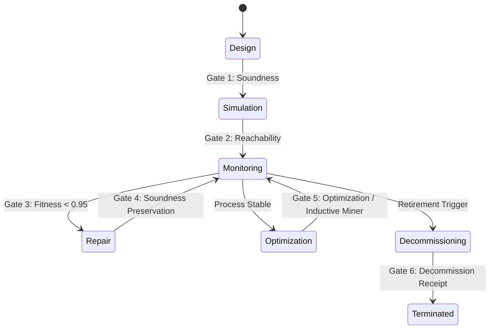

# Truex <-> Blue River Dam Integration Contract

This contract defines the integration schemas, validation boundaries, and structural shapes governing the flow of execution trust objects between Truex, the Blue River Dam orchestrator, and the `wasm4pm-compat` type-law compatibility layer.

---

## I. Truex Receipt Ingress Shapes

All execution traces and state changes crossing the Blue River Dam boundary must be presented as a Truex Receipt Envelope. Truex validates the cryptographic and logical structure of the envelope using the BLAKE3 algorithm.

### 1. Admission Shape (Receipt Envelope Schema)

An admitted receipt envelope JSON must conform to the following schema:

```json
{
  "truex_profile": "truex.ocel2.receipt.v1",
  "trace_id": "e14c6f769b4ed68ab600771ebf21dec4",
  "span_id": "e14c6f769b4ed68a",
  "session_id": "APP_SESSION_991",
  "device_id": "DEVICE_A22",
  "admission_status": "ReceiptAdmitted",
  "expected_path_hash": "5548b5fcac3109bcc176bad6f91e1408cbef34e87b1cba6cdf55a672f64b5694",
  "ocel2_batch_hash": "c13adf8815ec50ece8b9b9aa7ca3398eeae3c2acd21291deba20a959ad723850",
  "receipt_hash": "2cbb73c977e8b2b490fc9549d5741b5fa2676615d31bff534beb217ce36120b4",
  "ocel2": {
    "eventTypes": {
      "Mutation": {
        "attributes": ["causality", "actor"]
      },
      "ReceiptDecision": {
        "attributes": ["decision", "reason"]
      }
    },
    "objectTypes": {
      "User": { "attributes": ["role"] },
      "Session": { "attributes": ["platform"] },
      "Order": { "attributes": ["currency"] }
    },
    "events": [
      {
        "ocel:id": "evt_1779642285748_77bsv",
        "ocel:type": "Mutation",
        "ocel:timestamp": "2026-05-24T17:04:45.747Z",
        "ocel:attributes": {
          "causality": "User tapped 'Add to Cart'",
          "actor": "USER_442"
        }
      }
    ],
    "objects": [
      {
        "ocel:id": "USER_442",
        "ocel:type": "User",
        "ocel:attributes": { "role": "Customer" }
      }
    ],
    "event-object": [
      {
        "ocel:event-id": "evt_1779642285748_77bsv",
        "ocel:object-id": "USER_442",
        "ocel:qualifier": "initiated"
      }
    ],
    "object-object": [],
    "objectChanges": []
  }
}
```

### 2. Validation & Hashing Invariants

To pass Truex verification, an envelope must satisfy three invariants:

1. **OCEL 2.0 Batch Canonicalization:**
   The `ocel2` payload is canonicalized into a sorted, whitespace-free JSON representation where:
   - Object keys are sorted lexicographically.
   - Event arrays are sorted by `ocel:id`.
   - Event-object relationship arrays are sorted by `ocel:event-id | ocel:object-id | ocel:qualifier`.
   - Object attribute progression timelines are sorted by `ocel:object-id | ocel:timestamp | ocel:field`.
   
   $$\text{ocel2\_batch\_hash} = \text{BLAKE3}(\text{canonical\_stringify}(\text{ocel2}))$$

2. **Receipt Seal Invariant:**
   The cryptographic seal binding the session metadata, ocel2 delta batch, and expected execution pathway hash is computed as:
   
   $$\text{receipt\_hash} = \text{BLAKE3}(\text{session\_id} \mathbin{\Vert} \text{":"} \mathbin{\Vert} \text{ocel2\_batch\_hash} \mathbin{\Vert} \text{":"} \mathbin{\Vert} \text{expected\_path\_hash})$$

3. **Status Check:**
   The `admission_status` must be exactly `"ReceiptAdmitted"`.

### 3. Truex Refusal (Rejection Statuses)

If verification fails, the boundary returns a status mismatch corresponding to the `VerificationResult` enum:

| Verification Status | Root Cause |
|---|---|
| `"BoundaryMissing"` | The `ocel2` payload object is missing from the receipt envelope. |
| `"ReceiptForged"` | Either the computed `ocel2_batch_hash` does not match the provided hash, or the computed `receipt_hash` does not match the signature. |
| `"InvalidTransition"` | The envelope's `admission_status` is not `"ReceiptAdmitted"`. |
| `"ReceiptLaundered"` | Double-admission or raw event log bypassing target boundaries detected. |
| `"SummaryOnlyProof"` | Envelope contains hashes but lacks underlying log verification context. |
| `"CanonicalizationMismatch"`| String representation layout mismatch under serialization profile. |
| `"ReplayDetected"` | Identical receipt hash or session identifier already registered in ledger. |
| `"IncompletePath"` | Actual event sequence did not cover all mandatory steps in the causal timeline. |
| `"VerifierMismatch"` | The signing public key does not map to a recognized, trusted authority. |

---

## II. Blue River Dam Orchestrator Quality Gates

The Blue River Dam orchestrator enforces quality boundaries during process execution state transitions.



### 1. Gate Criteria & Status Mappings

| Gate | Lifecycle Transition | Gate Criterion | Failure Refusal |
|---|---|---|---|
| **Gate 1** | Design $\rightarrow$ Simulation | $\text{WF-net sound}(N) \equiv \text{true}$ | `ArchitectRefusal::UnsoundNet` / `GateRefusal::SoundnessViolation` |
| **Gate 2** | Simulation $\rightarrow$ Monitoring | $\text{RG}(N) \text{ bounded } \wedge \text{ no deadlocks}$ | `GateRefusal::DeadlockDetected` / `OperatorRefusal::UnapprovedTopology` |
| **Gate 3** | Monitoring $\rightarrow$ Operations | $\text{fitness}(\sigma, N) \ge 0.95 \vee (\text{fitness} \ge 0.85 \wedge \text{override}(\sigma))$ | `GateRefusal::FitnessThresholdViolation` |
| **Gate 4** | Repair $\rightarrow$ Monitoring | $\text{sound}(N') \equiv \text{true } \wedge \text{ repairs isolated to S-components}$ | `DoctorRefusal::RollbackFailed` / `GateRefusal::SoundnessViolation` |
| **Gate 5** | Optimization $\rightarrow$ Monitoring | $D_p(N_{\text{opt}}) < D_p(N_{\text{active}}) \wedge \text{Inductive Miner discovery}$ | `GateRefusal::DebtIncrease` |
| **Gate 6** | Decommission $\rightarrow$ Terminated | $\text{active}(N) \equiv \text{false } \wedge \text{ verify\_receipt}(R_d) \equiv \text{true}$ | `GateRefusal::InvalidReceipt` / `OrchestrationRefusal::GateViolation` |

---

## III. Wasm4pm-compat Admission/Refusal Type System

The type-law compatibility layer enforces compile-time and runtime validation boundaries before events enter the mining engine.

### 1. Type Declarations

- **Admission Shape:**
  ```rust
  pub struct Admission<T, W> {
      pub value: T,
      witness: PhantomData<W>,
  }
  ```
- **Refusal Shape:**
  ```rust
  pub struct Refusal<R, W> {
      pub reason: R,
      witness: PhantomData<W>,
  }
  ```

### 2. The 11 Rejection Pathways (Refusal Reasons `R`)

Every raw input must survive eleven independent verification checks:

1. **Temporal Monotonicity Violation:**
   - **Reason:** `RefusalReport::TemporalAnomaly { case_id, anomaly_at, evidence }`
   - **Check:** $\forall e_i, e_j \in \sigma \text{ s.t. } i < j, \, \text{timestamp}(e_i) \le \text{timestamp}(e_j)$
2. **Schema Mismatch:**
   - **Reason:** `RefusalReport::SchemaViolation { payload_type, error_detail, location }`
   - **Check:** Payload matches target XES (IEEE 1849) or OCEL 2.0 (ISO 23745) JSON/SQLite schema.
3. **Causal Disconnection (Missing Objects):**
   - **Reason:** `RefusalReport::CausalDisconnect { event_id, missing_object }`
   - **Check:** $\forall o_r \in e.\text{related\_objects}, \, \exists o \in L \text{ s.t. } o.id = o_r$
4. **Memory Bounds Violation:**
   - **Reason:** `RefusalReport::MemoryBoundsViolation { payload_size, limit }`
   - **Check:** Payload fits within WASM linear memory ceiling (100MB).
5. **Cryptographic Signature Invalid:**
   - **Reason:** `RefusalReport::HashMismatch { expected, actual }` / `SignatureVerificationFailed { authority }`
   - **Check:** $\text{VerifySignature}(\text{PublicKey}_{\text{Authority}}, \text{sig}, \text{hash}) \equiv \text{true}$
6. **Petri Net Unsoundness:**
   - **Reason:** `RefusalReport::UnsoundPetriNet { reason }`
   - **Check:** Structural soundness checks (unique initial source, unique final sink, liveness, boundeness).
7. **Fitness Threshold Underflow:**
   - **Reason:** `RefusalReport::FitnessThresholdViolation { fitness, threshold, reason }`
   - **Check:** Fitness $\ge 0.85$.
8. **Object Identity Conflict (Attribute Backtracking):**
   - **Reason:** `RefusalReport::ObjectIdentityConflict { object_id, attribute, event_indices, conflict }`
   - **Check:** Monotonic progression of object state attributes; no contradictory historical assertions.
9. **Ambiguous OR-Join Gateway:**
   - **Reason:** `RefusalReport::AmbiguousBpmnGateway { gateway_id, gateway_type, reason, accepted_policies }`
   - **Check:** OR-Join gateways must explicitly define their quorum resolution policy (e.g. `smart_completion`).
10. **Declare Constraint Lattice Not Integrated:**
    - **Reason:** `RefusalReport::UnsupportedFeature { feature, version, available_in, reason }`
    - **Check:** v30.1.2 fails models using Declare constraints due to pending Phase 3a integration.
11. **Log Duplicate Event IDs:**
    - **Reason:** `RefusalReport::DuplicateEventId { event_id, duplicate_count }`
    - **Check:** $\forall e_a, e_b \in L, \, e_a.id = e_b.id \implies a = b$

---

## IV. TRUEX CONSEQUENCE CELL → ALPHA TRUST OBJECT TRANSFORMATION (AGENT 6)

### 1. What Enters Blue River Dam from Truex?

**Source:** Admitted consequence cells from the Truex hook-first architecture.

**Formal Definition:**
A consequence cell Γ = ⟨attempt, hook, projection, decision, mailbox, receipt, replay, accounting⟩ where:

- `decision ∈ {ADMIT, REWRITE, QUEUE}` (REFUSE does not reach the dam; it is terminal at the hook)
- `receipt` contains BLAKE3 proof binding delta and causal timeline
- `projection` has been reduced to O* (lawful operational closure)
- `mailbox` durably stores motion that passes replay stability test
- `accounting` conserves P-invariants across all transitions

**Object Entry Shape:**

```yaml
consequence_cell:
  id: "cell_uuid_v4"
  attempt_id: "attempt_uuid"
  hook_stage: "projection_completed"
  
  decision:
    status: "ADMIT"  # or REWRITE / QUEUE
    timestamp: "2026-06-01T21:51:00Z"
    decision_code: 0x00  # ADMIT=0x00, REWRITE=0x01, QUEUE=0x02, etc.
    
  projection:
    form: "O*"  # lawful operational closure
    delta_bytes: "base64_encoded_delta"
    closure_signature: "blake3_hash"
    
  receipt_lineage:
    blake3:
      delta_hash: "blake3_hash_hex_64chars"
      timeline_hash: "blake3_hash_hex_64chars"
      combined_hash: "blake3_hash_hex_64chars"
    
    causal_timeline:
      - epoch: 1
        event: "hook_entry"
        timestamp: "2026-06-01T21:50:00Z"
        transition_id: "t_hook_enter"
      - epoch: 2
        event: "projection_compute"
        timestamp: "2026-06-01T21:50:30Z"
        transition_id: "t_project"
      - epoch: 3
        event: "admission_decision"
        timestamp: "2026-06-01T21:51:00Z"
        transition_id: "t_admit"
    
    lineage_proof: "hsm_signature_hex_128chars"
    
  mailbox_state:
    durable: true
    motion_tokens: ["token_id_1", "token_id_2"]
    persisted_at: "2026-06-01T21:51:15Z"
    
  replay_validation:
    stability_proven: true
    replay_count: 3
    all_replays_identical: true
    replay_fixture_id: "fixture_uuid"
    
  accounting:
    p_invariant_conserved: true
    initial_marking: "[p_source]"
    current_marking: "[p_sink]"
    conservation_signature: "blake3_hash"
```

### 2. Admission, Refusal, and Routing

#### A. Admitted Path (decision = ADMIT)

When Truex **admits** a consequence cell:

1. **Truex Hook Gate:** The attempt has passed all conditions:
   - Type check: Σ (structure matches schema)
   - Guard check: H (preconditions hold)
   - Transition check: T (transition exists and is enabled)
   - Policy check: P (does not violate LTL constraints Φ_Gov)
   - Capability/epoch check: C (system has authority and resources)
   - Freshness check: Fresh (timestamp is within acceptable window)
   - Receipt lineage check: R (all prior transitions are receipted)

2. **Projection to O*:** The raw attempt is reduced to lawful operational closure:
   $$\text{Projection} : \text{Attempt} \to O^* \subseteq \text{Valid States}$$

3. **BLAKE3 Receipt Generated:** The delta and causal timeline are hashed:
   $$\text{receipt\_hash} = \text{BLAKE3}(\text{delta\_bytes} \mathbin{\Vert} \text{timeline\_vector})$$

4. **Mailbox Durably Stored:** The cell is persisted in Truex ledger (cannot be lost or reverted without new receipt).

5. **Replay Stability Proven:** The cell is replayed N times (default N=3); all replays produce identical hashes:
   $$\forall n \in [1, N], \, \text{hash}(\text{replay}_n) = \text{hash}(\text{replay}_1)$$

6. **Accounting Conserved:** P-invariant equation holds:
   $$y^T \cdot M_{\text{before}} = y^T \cdot M_{\text{after}}$$

7. **Entry to Blue River Dam:** The admitted cell enters the dam as a **candidate trust object**. The dam's `ostar-auditor` performs conformance alignment:
   $$\gamma^* = \operatorname{argmin}_{\gamma} \sum c(t, a)$$
   
   If fitness = 1.0 (perfect synchronous alignment), the cell **becomes a trust object** and is promoted to `ostar-operator` for atomic durable motion.

#### B. Refusal Path (decision = REFUSE)

When Truex **refuses** a consequence attempt:

1. **Terminal at Hook:** The attempt dies at the hook membrane. Refusal is lawful terminality, not exception.

2. **Refusal Receipt Issued:** A receipt is generated with decision code = REFUSE:
   ```yaml
   receipt:
     decision: "REFUSE"
     reason: "Reason code (e.g., Guard condition false)"
     timestamp: "2026-06-01T21:51:00Z"
     blake3: "blake3_hash_of_refusal"
   ```

3. **Does NOT Enter Dam:** Refusal is terminal at Truex boundary. It does not propagate to Blue River Dam.

4. **Accounting Recorded:** The refusal is logged in Truex mailbox and accounting ledger for historical audit.

5. **No Promotion:** Refused attempts are not promoted to any downstream system.

#### C. Rewrite Path (decision = REWRITE)

When Truex **rewrites** a consequence attempt (e.g., routing to elastic repair):

1. **Projection Modified:** The original delta is transformed into a lawful repair pattern:
   $$\text{Rewritten Δ} = \text{repair}(\text{Original Δ})$$

2. **New Receipt Generated:** The rewritten form is receipted:
   $$\text{new\_receipt\_hash} = \text{BLAKE3}(\text{rewritten\_delta} \mathbin{\Vert} \text{extended\_timeline})$$

3. **Original Attempt Preserved:** The original attempt_id is preserved in the causal timeline for traceability.

4. **Enters Dam as Rewritten:** The cell enters the dam with:
   - `decision = REWRITE` (not ADMIT)
   - Original attempt_id in lineage
   - Rewrite reason documented in receipt
   - Both original and rewritten deltas stored

5. **Authority Boundary:** Only `ostar-operator` (for T_elastic repairs) or `ostar-governor` (for T_compliance) may authorize rewrites.

#### D. Queued Path (decision = QUEUE)

When Truex **queues** an attempt (requires external approval or human review):

1. **Attempt Not Yet Admitted:** The decision is deferred, not terminal.

2. **Queue Receipt Issued:**
   ```yaml
   receipt:
     decision: "QUEUE"
     reason: "Awaiting external approval"
     queue_depth: 5
     queue_wait_time: "PT2H30M"
     queue_timestamp: "2026-06-01T21:51:00Z"
   ```

3. **Does NOT Enter Dam (Yet):** Queued attempts remain in Truex mailbox until dequeued.

4. **Dequeue → Re-admission:** When the external condition resolves, the queued attempt is dequeued and re-evaluated:
   - If approved: decision = ADMIT (enters dam)
   - If rejected: decision = REFUSE (terminal, does not enter dam)

5. **Causal Timeline Extends:** The queue_timestamp and dequeue_timestamp are added to the timeline.

### 3. Minimum Receipt Shape

The minimum receipt that satisfies Blue River Dam admission requirements is:

```yaml
receipt:
  # Identifiers
  id: "receipt_uuid_v4"
  authority: "truex"
  attempt_id: "attempt_uuid"
  
  # Decision
  decision: "ADMIT"  # enum: ADMIT, REFUSE, REWRITE, QUEUE, ROLLBACK, QUARANTINE
  decision_code: 0x00  # 0-byte int for compact encoding
  timestamp: "2026-06-01T21:51:00Z"  # ISO 8601
  
  # Cryptographic Binding
  blake3:
    delta_hash: "5548b5fcac3109bcc176bad6f91e1408cbef34e87b1cba6cdf55a672f64b5694"  # 64-char hex
    timeline_hash: "c13adf8815ec50ece8b9b9aa7ca3398eeae3c2acd21291deba20a959ad723850"  # 64-char hex
    combined_hash: "2cbb73c977e8b2b490fc9549d5741b5fa2676615d31bff534beb217ce36120b4"  # 64-char hex
  
  # Causal Timeline (Minimal)
  causal_timeline:
    - epoch: 1
      ts: "2026-06-01T21:50:00Z"
    - epoch: 2
      ts: "2026-06-01T21:50:30Z"
    - epoch: 3
      ts: "2026-06-01T21:51:00Z"
  
  # Lineage Proof
  lineage_proof: "hsm_signature_hex_128chars_ed25519_or_ecdsa"
  
  # Promotion Eligibility
  promotion_eligible: true
```

**Non-Optional Fields:**
- `decision`: Admission status code
- `timestamp`: Absolute epoch of decision
- `blake3.combined_hash`: BLAKE3 proof of delta + timeline
- `causal_timeline`: Vector of (epoch, timestamp) pairs
- `lineage_proof`: Cryptographic signature proving authorization

**Optional Fields (Audit/Metadata):**
- `reason`: Human-readable explanation of decision
- `replay_count`: Number of replay validations performed
- `accounting_signature`: Conservation proof

### 4. How Alpha Becomes a Trust Object

A consequence cell Γ is **not** a trust object merely by being admitted. It **becomes** a trust object through a multi-stage transformation:

#### Stage 1: Attempt (Raw Proposal)
```
Γ_attempt = attempt that proposes motion
Status: UNVERIFIED
```

#### Stage 2: Hook Projection (Reduced to O*)
```
Γ_attempt → Γ_projected(O*)
Hook applies:
  - Type guard (C, H, T, P, C_fresh, R)
  - Reduces to lawful closure
Status: PROJECTED, not yet admitted
```

#### Stage 3: Receipt Admission (BLAKE3 Signed)
```
Γ_projected → Γ_admitted{decision=ADMIT, receipt=R}
Truex:
  - Computes BLAKE3(delta || timeline)
  - Signs with HSM key
  - Stores in mailbox
Status: ADMITTED, durable
```

#### Stage 4: Replay Stability (Proven Idempotent)
```
Γ_admitted → Γ_stable{replay_count=3, all_identical=true}
Truex:
  - Replays N times (default N=3)
  - Verifies all receipts hash identically
  - Confirms Π(H(Δ)) = stable
Status: STABLE
```

#### Stage 5: Accounting Conservation (P-Invariant Holds)
```
Γ_stable → Γ_accounted{y^T·M_before = y^T·M_after}
Truex:
  - Verifies P-invariant equation
  - Confirms no token loss/creation
  - Seals conservation proof
Status: ACCOUNTED
```

#### Stage 6: Blue River Dam Conformance (Fitness = 1.0)
```
Γ_accounted → Γ_in_dam{Fitness(σ, W) = 1.0}
Dam:
  - Auditor computes optimal alignment
  - Verifies trace matches petri net perfectly
  - Issues conformance receipt
Status: IN_DAM, waiting for promotion
```

#### Stage 7: Typestate Verification (Compile-Time Proof)
```
Γ_in_dam → Γ_typeverified{CompileOK(TypeState)}
WASM:
  - Type system proves no illegal transitions
  - Bytecode cannot execute non-compliant states
  - Structural proof inlined
Status: TYPEVERIFIED
```

#### Stage 8: Trust Object (Promotion Eligible)
```
Γ_typeverified → Γ_trust_object{σ ⊢ W, R ⊢ δ, Π ⊢ stability}
Object now satisfies all trust properties:
  - Receipt lineage complete
  - Conformance proven (fitness = 1.0)
  - Replay stable
  - Accounting conserved
  - Typestate verified
  - Promotion eligible for next lifecycle stage
Status: TRUST_OBJECT, may be promoted
```

#### Final State Invariant

Once Γ is a trust object, it **cannot** be altered, deleted, or reverted except via:
1. **Explicit Rollback** (issued by `ostar-doctor` due to conformance violation) → New ROLLBACK receipt issued
2. **Promotion** (authorized by `ostar-operator` or `ostar-governor`) → Moves to next lifecycle stage

The invariant is:
$$\text{TrustObject}(\Gamma) \iff \forall \text{property} \in \{\text{receipt}, \text{replay}, \text{accounting}, \text{conformance}, \text{typestate}\}, \, \text{verified}(\text{property}) = \text{true}$$

### 5. Authority Boundaries

| Role | Transition | Authority |
|---|---|---|
| `ostar-hook` (Truex) | attempt → projection | Type checking (C, H, T, P, C_fresh, R) |
| `ostar-operator` (Truex) | projection → admitted | ADMIT/REFUSE decision, mailbox write |
| `ostar-auditor` (Dam) | admitted → conformance_checked | Alignment computation, fitness calculation |
| `ostar-doctor` (Dam) | conformance_fail → rollback | Kinetic nullification, containment |
| `ostar-governor` (Dam) | T_compliance → GovToken | Policy mutations, override authority |

---

## V. POST-CYBERPUNK FRAMING

### Present Cyberpunk (what BRD replaces)
- Hallucination-as-output: LLM candidates treated as authoritative world-state
- Logic-chaos governance: branching, unbounded mutation, invisible retries
- Unreceipted claims: completion declared without replayable proof
- Human-in-the-loop as hidden runtime: Mechanical Turk inside the boundary
- `O → human μ → A`: action projected from raw human interpretation

### Post-Cyberpunk (what BRD enforces)
- Receipt-as-proof: no claim is authorized without BLAKE3-sealed receipt lineage
- Bounded mutation: max-8 lanes, Planck-cell deltas, Need9 split before admission
- Coordinate-system representation: world-state is typed, bounded, and witness-verified
- Deterministic admission function: `A = μ(O*)` — action from lawful closure, not raw observation
- `R ⊢ A = μ(O*)`: action is proven by receipt lineage, not merely claimed

The Blue River Dam is a Post-Cyberpunk artifact. It does not tolerate hallucination at the gate.

---

## VI. HOW THIS AVOIDS BEING A TRADING BOT

Blue River Dam is a coordination and control protocol for bounded world-state transitions.

It admits and routes world-state representations. It enforces receipt-gated admission.
It routes consequence claims to appropriate downstream surfaces.

It does not:
- Execute trades or place orders
- Connect to brokers, exchanges, or custodians
- Hold or transfer capital
- Consume real-time market data feeds
- Emit signals to execution venues

Capital-flow claims are routed out to settlement surfaces — they do not execute inside the dam.
Process claims are routed to the wasm4pm evidence adapter — they do not trigger financial actions.

The no-live-trading boundary is enforced by `check_no_live_trading.sh` (PASS, 2026-06-01).
No exchange API keys, broker credentials, or custodian references exist in the codebase.

---

## VII. INTEGRATION STATUS

**Contract Authority:** Blue River Dam v30.1.1 + Truex Post-Gall Substrate

**Status:** ACTIVE

**Last Updated:** 2026-06-01

**Next Phase:** Implement Telco (boundary communication) integration to prevent authority smuggling from external systems.
