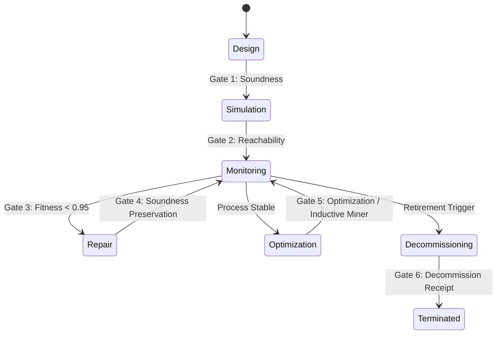

# Truex Receipt Contract

**Adapter:** Truex → construct8-market-physics → Blue River Dam
**Governing law:** No hook, no consequence. No receipt, no authority.
**Date:** 2026-06-01

---

## What Truex Consumes from construct8-market-physics

Truex consumes CONSTRUCT8 witness outputs — not raw market signals, not trading data.

Specifically:
- Graph-state delta objects: bounded Planck-cell deltas (max-8 lanes, u64 state hashes)
- Causal time vectors: monotonic u64 clock values from c8-time, verified for rollback-freedom
- Adversary-gap witnesses: RepresentationGap proofs confirming feature-collapse boundaries
- BLAKE3 receipt stubs: pre-computed `[u8; 32]` hashes from c8-receipts, replayed for stability

Truex does not consume:
- Raw market data streams
- LLM inference outputs
- Unreceipted observation claims
- Need9 objects (split must occur inside CONSTRUCT8 before Truex boundary)

The CONSTRUCT8 witness is a relational graph-state engine, not a query.
Truex treats its output as lawful operational closure (O*), not as a candidate answer.

---

## What Truex Emits

Truex emits consequence receipts — BLAKE3-sealed proofs that a consequence cell was admitted
or refused through the hook-first architecture.

Emitted receipt structure (minimum shape):

```yaml
truex_receipt:
  truex_profile: "truex.ocel2.receipt.v1"
  trace_id: "<uuid>"
  session_id: "<session>"
  admission_status: "ReceiptAdmitted"   # or refusal status
  ocel2_batch_hash: "<blake3_hex>"
  receipt_hash: "<blake3_hex>"
  ocel2: { ... }                        # OCEL 2.0 event log of the consequence cell lifecycle
```

The receipt_hash seals:
```
BLAKE3(session_id || ":" || ocel2_batch_hash || ":" || expected_path_hash)
```

Truex emits refusal receipts for all 9 refusal statuses (BoundaryMissing, ReceiptForged,
InvalidTransition, ReceiptLaundered, SummaryOnlyProof, CanonicalizationMismatch,
ReplayDetected, IncompletePath, VerifierMismatch).

Truex does not emit:
- Trading signals
- LLM proposals
- Policy suggestions
- Unreceipted state changes

---

## The Frame: No Hook, No Consequence from Truex Perspective

From Truex's perspective, the CONSTRUCT8 witness is an upstream lawful closure provider.
Truex applies the Chatman Equation in receipted form:

```
R ⊢ A = μ(O*)
```

Where:
- `O*` = CONSTRUCT8-witnessed, bounded, max-8, Need9-refused graph-state
- `μ`  = Truex hook-first admission function (deterministic, no LLM in path)
- `A`  = admitted consequence or lawful refusal
- `R`  = BLAKE3-sealed OCEL 2.0 receipt proving the consequence

If CONSTRUCT8 does not produce O* (hook not triggered), Truex has nothing to admit.
There is no consequence without a hook. There is no authority without a receipt.

Truex is not a hook into CONSTRUCT8. Truex is the consequence cell downstream of it.

---

## Detailed Integration Schemas

This contract also defines the integration schemas, validation boundaries, and structural shapes governing the flow of execution trust objects between Truex, the Blue River Dam orchestrator, and the `wasm4pm-compat` type-law compatibility layer.

---

## I. Truex Receipt Ingress Shapes

All execution traces and state changes crossing the Blue River Dam boundary must be presented as a Truex Receipt Envelope. Truex validates the cryptographic and logical structure of the envelope using the BLAKE3 algorithm.

### 1. Admission Shape (Receipt Envelope Schema)

An admitted receipt envelope JSON must conform to the following schema:

```json
{
  "truex_profile": "truex.ocel2.receipt.v1",
  "trace_id": "e14c6f769b4ed68ab600771ebf21dec4",
  "span_id": "e14c6f769b4ed68a",
  "session_id": "APP_SESSION_991",
  "device_id": "DEVICE_A22",
  "admission_status": "ReceiptAdmitted",
  "expected_path_hash": "5548b5fcac3109bcc176bad6f91e1408cbef34e87b1cba6cdf55a672f64b5694",
  "ocel2_batch_hash": "c13adf8815ec50ece8b9b9aa7ca3398eeae3c2acd21291deba20a959ad723850",
  "receipt_hash": "2cbb73c977e8b2b490fc9549d5741b5fa2676615d31bff534beb217ce36120b4",
  "ocel2": {
    "eventTypes": {
      "Mutation": {
        "attributes": ["causality", "actor"]
      },
      "ReceiptDecision": {
        "attributes": ["decision", "reason"]
      }
    },
    "objectTypes": {
      "User": { "attributes": ["role"] },
      "Session": { "attributes": ["platform"] },
      "Order": { "attributes": ["currency"] }
    },
    "events": [
      {
        "ocel:id": "evt_1779642285748_77bsv",
        "ocel:type": "Mutation",
        "ocel:timestamp": "2026-05-24T17:04:45.747Z",
        "ocel:attributes": {
          "causality": "User tapped 'Add to Cart'",
          "actor": "USER_442"
        }
      }
    ],
    "objects": [
      {
        "ocel:id": "USER_442",
        "ocel:type": "User",
        "ocel:attributes": { "role": "Customer" }
      }
    ],
    "event-object": [
      {
        "ocel:event-id": "evt_1779642285748_77bsv",
        "ocel:object-id": "USER_442",
        "ocel:qualifier": "initiated"
      }
    ],
    "object-object": [],
    "objectChanges": []
  }
}
```

### 2. Validation & Hashing Invariants

To pass Truex verification, an envelope must satisfy three invariants:

1. **OCEL 2.0 Batch Canonicalization:**
   The `ocel2` payload is canonicalized into a sorted, whitespace-free JSON representation where:
   - Object keys are sorted lexicographically.
   - Event arrays are sorted by `ocel:id`.
   - Event-object relationship arrays are sorted by `ocel:event-id | ocel:object-id | ocel:qualifier`.
   - Object attribute progression timelines are sorted by `ocel:object-id | ocel:timestamp | ocel:field`.
   
   $$\text{ocel2\_batch\_hash} = \text{BLAKE3}(\text{canonical\_stringify}(\text{ocel2}))$$

2. **Receipt Seal Invariant:**
   The cryptographic seal binding the session metadata, ocel2 delta batch, and expected execution pathway hash is computed as:
   
   $$\text{receipt\_hash} = \text{BLAKE3}(\text{session\_id} \mathbin{\Vert} \text{":"} \mathbin{\Vert} \text{ocel2\_batch\_hash} \mathbin{\Vert} \text{":"} \mathbin{\Vert} \text{expected\_path\_hash})$$

3. **Status Check:**
   The `admission_status` must be exactly `"ReceiptAdmitted"`.

### 3. Truex Refusal (Rejection Statuses)

If verification fails, the boundary returns a status mismatch corresponding to the `VerificationResult` enum:

| Verification Status | Root Cause |
|---|---|
| `"BoundaryMissing"` | The `ocel2` payload object is missing from the receipt envelope. |
| `"ReceiptForged"` | Either the computed `ocel2_batch_hash` does not match the provided hash, or the computed `receipt_hash` does not match the signature. |
| `"InvalidTransition"` | The envelope's `admission_status` is not `"ReceiptAdmitted"`. |
| `"ReceiptLaundered"` | Double-admission or raw event log bypassing target boundaries detected. |
| `"SummaryOnlyProof"` | Envelope contains hashes but lacks underlying log verification context. |
| `"CanonicalizationMismatch"`| String representation layout mismatch under serialization profile. |
| `"ReplayDetected"` | Identical receipt hash or session identifier already registered in ledger. |
| `"IncompletePath"` | Actual event sequence did not cover all mandatory steps in the causal timeline. |
| `"VerifierMismatch"` | The signing public key does not map to a recognized, trusted authority. |

---

## II. Blue River Dam Orchestrator Quality Gates

The Blue River Dam orchestrator enforces quality boundaries during process execution state transitions.



### 1. Gate Criteria & Status Mappings

| Gate | Lifecycle Transition | Gate Criterion | Failure Refusal |
|---|---|---|---|
| **Gate 1** | Design $\rightarrow$ Simulation | $\text{WF-net sound}(N) \equiv \text{true}$ | `ArchitectRefusal::UnsoundNet` / `GateRefusal::SoundnessViolation` |
| **Gate 2** | Simulation $\rightarrow$ Monitoring | $\text{RG}(N) \text{ bounded } \wedge \text{ no deadlocks}$ | `GateRefusal::DeadlockDetected` / `OperatorRefusal::UnapprovedTopology` |
| **Gate 3** | Monitoring $\rightarrow$ Operations | $\text{fitness}(\sigma, N) \ge 0.95 \vee (\text{fitness} \ge 0.85 \wedge \text{override}(\sigma))$ | `GateRefusal::FitnessThresholdViolation` |
| **Gate 4** | Repair $\rightarrow$ Monitoring | $\text{sound}(N') \equiv \text{true } \wedge \text{ repairs isolated to S-components}$ | `DoctorRefusal::RollbackFailed` / `GateRefusal::SoundnessViolation` |
| **Gate 5** | Optimization $\rightarrow$ Monitoring | $D_p(N_{\text{opt}}) < D_p(N_{\text{active}}) \wedge \text{Inductive Miner discovery}$ | `GateRefusal::DebtIncrease` |
| **Gate 6** | Decommission $\rightarrow$ Terminated | $\text{active}(N) \equiv \text{false } \wedge \text{ verify\_receipt}(R_d) \equiv \text{true}$ | `GateRefusal::InvalidReceipt` / `OrchestrationRefusal::GateViolation` |

---

## III. Wasm4pm-compat Admission/Refusal Type System

The type-law compatibility layer enforces compile-time and runtime validation boundaries before events enter the mining engine.

### 1. Type Declarations

- **Admission Shape:**
  ```rust
  pub struct Admission<T, W> {
      pub value: T,
      witness: PhantomData<W>,
  }
  ```
- **Refusal Shape:**
  ```rust
  pub struct Refusal<R, W> {
      pub reason: R,
      witness: PhantomData<W>,
  }
  ```

### 2. The 11 Rejection Pathways (Refusal Reasons `R`)

Every raw input must survive eleven independent verification checks:

1. **Temporal Monotonicity Violation:**
   - **Reason:** `RefusalReport::TemporalAnomaly { case_id, anomaly_at, evidence }`
   - **Check:** $\forall e_i, e_j \in \sigma \text{ s.t. } i < j, \, \text{timestamp}(e_i) \le \text{timestamp}(e_j)$
2. **Schema Mismatch:**
   - **Reason:** `RefusalReport::SchemaViolation { payload_type, error_detail, location }`
   - **Check:** Payload matches target XES (IEEE 1849) or OCEL 2.0 (ISO 23745) JSON/SQLite schema.
3. **Causal Disconnection (Missing Objects):**
   - **Reason:** `RefusalReport::CausalDisconnect { event_id, missing_object }`
   - **Check:** $\forall o_r \in e.\text{related\_objects}, \, \exists o \in L \text{ s.t. } o.id = o_r$
4. **Memory Bounds Violation:**
   - **Reason:** `RefusalReport::MemoryBoundsViolation { payload_size, limit }`
   - **Check:** Payload fits within WASM linear memory ceiling (100MB).
5. **Cryptographic Signature Invalid:**
   - **Reason:** `RefusalReport::HashMismatch { expected, actual }` / `SignatureVerificationFailed { authority }`
   - **Check:** $\text{VerifySignature}(\text{PublicKey}_{\text{Authority}}, \text{sig}, \text{hash}) \equiv \text{true}$
6. **Petri Net Unsoundness:**
   - **Reason:** `RefusalReport::UnsoundPetriNet { reason }`
   - **Check:** Structural soundness checks (unique initial source, unique final sink, liveness, boundeness).
7. **Fitness Threshold Underflow:**
   - **Reason:** `RefusalReport::FitnessThresholdViolation { fitness, threshold, reason }`
   - **Check:** Fitness $\ge 0.85$.
8. **Object Identity Conflict (Attribute Backtracking):**
   - **Reason:** `RefusalReport::ObjectIdentityConflict { object_id, attribute, event_indices, conflict }`
   - **Check:** Monotonic progression of object state attributes; no contradictory historical assertions.
9. **Ambiguous OR-Join Gateway:**
   - **Reason:** `RefusalReport::AmbiguousBpmnGateway { gateway_id, gateway_type, reason, accepted_policies }`
   - **Check:** OR-Join gateways must explicitly define their quorum resolution policy (e.g. `smart_completion`).
10. **Declare Constraint Lattice Not Integrated:**
    - **Reason:** `RefusalReport::UnsupportedFeature { feature, version, available_in, reason }`
    - **Check:** v30.1.2 fails models using Declare constraints due to pending Phase 3a integration.
11. **Log Duplicate Event IDs:**
    - **Reason:** `RefusalReport::DuplicateEventId { event_id, duplicate_count }`
    - **Check:** $\forall e_a, e_b \in L, \, e_a.id = e_b.id \implies a = b$
