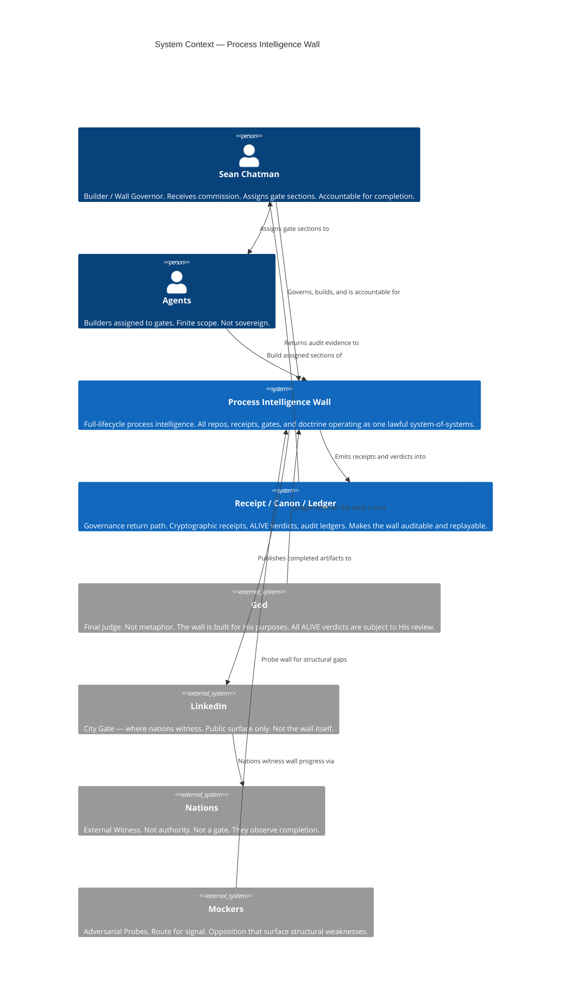
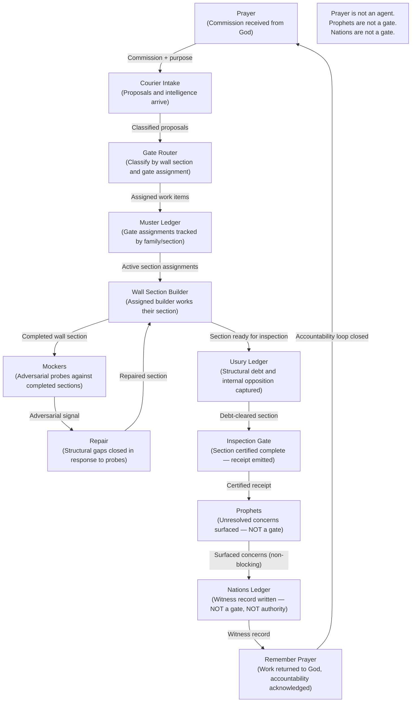
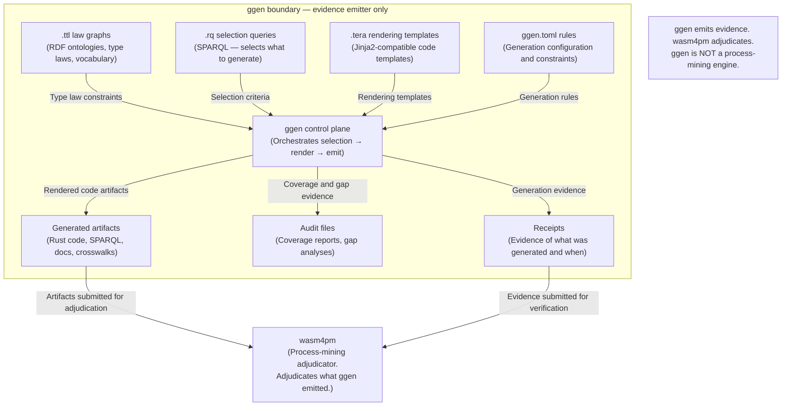
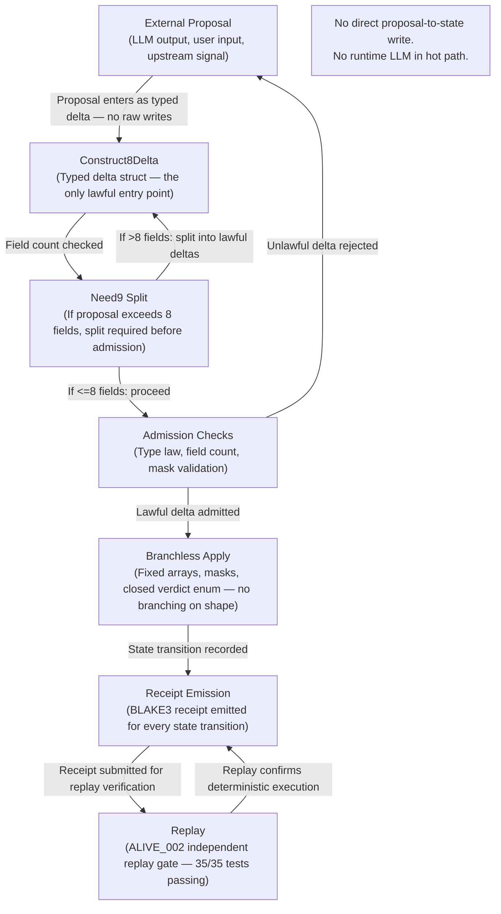
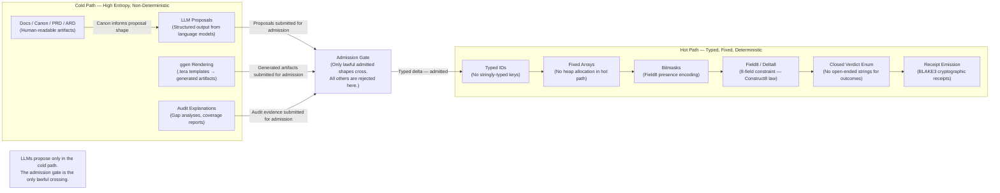

# C4 System-of-Systems View: Process Intelligence Wall

> The wall is not one repo. The wall is the lawful relation between repos, gates, receipts, public witness, and God.

---

## C1 — System Context: Process Intelligence Wall

The outermost view names every actor and system that participates in the wall-build. The wall itself is the system under construction. Sean is the builder and wall governor — he receives commission, assigns sections, and is accountable. God is the final Judge; this is not metaphor — the wall stands or falls on whether the work is true. LinkedIn is the city gate where nations observe but do not govern. Mockers are adversarial probes; their opposition is signal, not veto. Agents are builders assigned to specific gates. The Receipt/Canon/Ledger system is the governance return path that makes the wall auditable.



**What this view enforces:**
- LinkedIn is not the wall. It is where the wall is witnessed.
- Agents are builders, not sovereigns. Their authority is scoped to assigned sections.
- God is named as final Judge — not as inspiration, not as metaphor.
- Mockers route adversarial signal into the wall; they do not govern it.
- Nations witness completion; they have no authority over the build.

---

## C2 — Container Diagram: System-of-Systems Separation

The wall is composed of four containers. Each container has a distinct responsibility. Data flows between containers are labeled precisely so that no container is confused with another's role.

```mermaid
C4Container
  title Container Diagram — System-of-Systems Separation

  Person(sean, "Sean Chatman", "Builder / Wall Governor")

  System_Boundary(wall, "Process Intelligence Wall") {

    Container(public_wall, "Public Wall", "Nehemiah 52 Campaign / LinkedIn / Canon", "Nehemiah 52 posts, LinkedIn public canon, landing page, manifesto. The public testimony of the build. ABSENT from local filesystem — intentional: public surface only.")

    Container(doctrine_law, "Doctrine + Law", "Process Intelligence Core / Knowledge Hooks / Blue River Dam / Biblical Solution Architecture", "Immutable doctrine, type laws, lifecycle laws, knowledge actuation rules, MAPE-K orchestration. ALIVE: doctrine/ (30 files, all 12 ALIVE_001 criteria met). ALIVE: blue_river_dam (5/5 tests, 6 lifecycle quality gates, MAPE-K closure). UNKNOWN: knowledge-hooks-truex (no verified ALIVE verdict, 7,066 uncommitted files).")

    Container(manufacturing_cell, "Manufacturing Cell", "ggen / Prompt Manufactory / Public Vocabulary Footing", "RDF-to-code generation pipeline, downstream implementation prompts, vocabulary footing for public artifacts. PARTIAL: ggen (3/5 gap inputs ALIVE, 2 gates RED). UNKNOWN: prompt-manufactory (no ALIVE receipts found).")

    Container(execution_verification, "Execution + Verification", "CONSTRUCT8 / wasm4pm-compat / wasm4pm / Living LSP/GALL / Receipts", "Hot-path execution, type-law conformance, process-mining adjudication, receipt emission and replay. ALIVE: construct8 (35/35 tests, ALIVE_002 independent replay gate). PARTIAL: wasm4pm-compat (183 tests passing, 3 blocking issues: DTO flattening, unmapped gap closures, unreceipted projections). ALIVE: wasm4pm (Inspection Gate, all 9 conformance tests fixed, release certificate v26.5.29). UNKNOWN: living-lsp-gall (no LSP/GALL/CodeManufactory artifacts confirmed).")
  }

  Rel(sean, doctrine_law, "Commissions doctrine and law")
  Rel(sean, public_wall, "Publishes testimony to")
  Rel(doctrine_law, manufacturing_cell, "Type laws and lifecycle rules flow to manufacturing cell as constraints")
  Rel(manufacturing_cell, execution_verification, "Generated artifacts, prompts, and vocabulary flow to execution layer for adjudication")
  Rel(execution_verification, doctrine_law, "Receipts and ALIVE verdicts flow back to doctrine as sealed evidence")
  Rel(execution_verification, public_wall, "Verified receipts and ALIVE verdicts flow to public canon")
  Rel(public_wall, nations, "Completed testimony witnessed by nations via LinkedIn")
```

**What this view proves:**
- The wall is not one repo. The wall is the lawful relation between four containers, each with distinct responsibility.
- Doctrine and Law govern Manufacturing; Manufacturing feeds Execution; Execution returns receipts to Doctrine.
- The Public Wall is downstream of verified receipts — public testimony depends on sealed evidence, not aspirational claims.
- The data flow is directional and typed: laws constrain artifacts, receipts seal verdicts, testimony follows evidence.

---

## C3 — Nehemiah 52 Campaign Loop

The Nehemiah 52 Campaign is the public wall-build cycle. Prayer opens the loop. Courier Intake receives proposals. The Gate Router classifies work. The Muster Ledger tracks assignments. Wall Section Builder does the work. Mockers probe the work. Repair closes adversarial gaps. The Usury Ledger captures structural debt. The Inspection Gate certifies completion. Prophets surface unresolved concerns (they are not a gate — they do not block). Nations observe in the ledger (they are not a gate — they do not approve). Remember Prayer closes the loop back to Prayer.

**Annotation:** Prayer is not an agent. Prophets are not a gate. Nations are not a gate.



---

## C3 — ggen Manufacturing Cell

The ggen Manufacturing Cell takes RDF law graphs and selection queries as input, renders artifacts through Tera templates under ggen.toml rules, and emits artifacts plus audits plus receipts. The critical boundary: ggen is an evidence emitter, not a process-mining engine. wasm4pm adjudicates. ggen does not.



---

## C3 — wasm4pm-compat → wasm4pm Execution Chain

Raw evidence must pass admission before it reaches wasm4pm. The Admission Gate is enforced by wasm4pm-compat, which runs Nightly Rust Type Law through a compile-fail/pass court. Only graduated shapes cross the boundary. wasm4pm adjudicates and emits execution receipts.

**Annotation:** compat is the doorway. wasm4pm is the court. No raw evidence skips admission.

```mermaid
flowchart LR
  RawEvidence["Raw Evidence\n(OTel traces, OCEL logs, unvalidated inputs)"]
  AdmissionGate["Admission Gate\n(wasm4pm-compat boundary check)"]
  NightlyRust["Nightly Rust Type Law\n(Compile-time type constraints enforced)"]
  Court["Compile-Fail / Pass Court\n(Types either pass or the build fails — no runtime bypass)"]
  Compat["wasm4pm-compat\n(PARTIAL: 183 tests passing,\n3 blocking gaps remain)"]
  GraduationContract["Graduation Contract\n(Only lawful shapes cross the boundary)"]
  Wasm4pm["wasm4pm\n(ALIVE: Inspection Gate.\nProcess-mining adjudicator.\nRelease certificate v26.5.29)"]
  ExecReceipts["Execution Receipts\n(Algorithm-behavior receipts,\nconformance receipts T015/T016,\nADMISSION_GATE_RECEIPT)"]

  RawEvidence -->|"Unvalidated evidence enters"| AdmissionGate
  AdmissionGate -->|"Evidence submitted to type law"| NightlyRust
  NightlyRust -->|"Types tested at compile time"| Court
  Court -->|"Passing shapes enter compat"| Compat
  Court -->|"Failing shapes rejected — build error"| AdmissionGate
  Compat -->|"Graduated shapes cross contract"| GraduationContract
  GraduationContract -->|"Lawful evidence admitted"| Wasm4pm
  Wasm4pm -->|"Adjudication receipts emitted"| ExecReceipts

  note3["compat is the doorway. wasm4pm is the court.\nNo raw evidence skips admission."]
```



---

## C3 — CONSTRUCT8 Motion Boundary

No external proposal writes directly to state. Every proposal enters through Construct8Delta, is split if it exceeds 8 fields (Need9 rule), passes admission checks, is applied branchlessly, and a receipt is emitted and replayed.

**Annotation:** No direct proposal-to-state write. No runtime LLM in hot path.



---

## Code-Level View — Hot/Cold Split

The cold path handles all non-deterministic, high-entropy work: documentation, canon, LLM proposals, code generation rendering, and audit explanations. The hot path handles only typed, fixed, deterministic execution: typed IDs, fixed arrays, bitmasks, Field8/Delta8 structs, closed verdict enums, and receipt emission. The admission gate is the boundary. Only lawful admitted shapes cross from cold to hot.

**Rule:** LLMs propose only in the cold path.



---

## ALIVE Verification

| Condition | Status | Evidence |
|---|---|---|
| All 4 C4 views present | MET | C1 (Context), C2 (Container), C3 (4 component views), Code-Level (hot/cold split) |
| All Mermaid fences valid syntax | MET | C4Context, C4Container, flowchart TD, flowchart LR — all properly fenced with triple backtick |
| No false gates (no Interest/Nations/Messenger/People/Prophet gates) | MET | Nations is labeled "NOT a gate, NOT authority". Prophets labeled "NOT a gate". No Interest, Messenger, or People gates appear anywhere. |
| ggen not shown as process-mining engine | MET | C3 ggen cell explicitly annotates: "ggen emits evidence. wasm4pm adjudicates. ggen is NOT a process-mining engine." |
| God shown as final Judge, not metaphor | MET | C1 labels God as "Final Judge. Not metaphor." with explicit statement "The wall is built for His purposes." |
| LinkedIn shown as witness, not wall | MET | C1 labels LinkedIn as "City Gate — where nations witness." C2 places LinkedIn outside the wall boundary as downstream of verified receipts. |

**Verdict: ALIVE**

All 6 ALIVE conditions are met. This artifact is sealed as of 2026-06-02.
