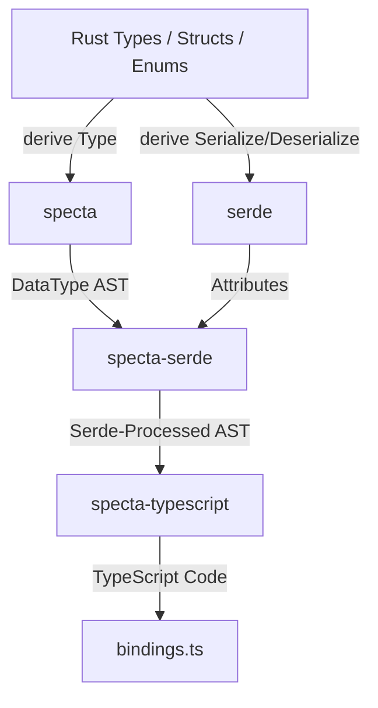

# Specta Capability Map: Rust-to-TypeScript Type Projection Lane

This document details the capabilities, constraints, and semantics of the **Specta** ecosystem (`specta`, `specta-serde`, `specta-typescript`) when used to project Rust data models into TypeScript types for frontend consumption.

---

## 1. Crate Architecture

The type projection lane is split into three main components to separate core reflection from serialization semantics and code generation:



### 1.1 `specta` (Core reflection)
*   **Purpose**: Exposes the `Type` trait and the `#[derive(Type)]` macro.
*   **Behavior**: Inspects Rust structures at compile time and builds an abstract syntax tree (AST) of the types via `DataType`.
*   **Features**: Supports generic parameters, nested structs, Rust primitives, smart pointers (`Box`, `Rc`, `Arc`), Option types, collections (`Vec`, `HashMap`, `HashSet`), and doc comment harvesting.

### 1.2 `specta-serde` (Serialization transformation)
*   **Purpose**: Resolves the difference between pure Rust definitions and how they are serialized by `serde`.
*   **Behavior**: Modifies the `DataType` AST by reading `#[serde(...)]` attributes. It transforms names (e.g., camelCase conversion), filters out skipped fields, flattens structures, and shapes enums according to the active tagging strategy.
*   **Modes**:
    *   **Symmetric (`Format`)**: Assumes the representation is the same for serialization and deserialization.
    *   **Asymmetric (`PhasesFormat`)**: Generates separate input (deserialize) and output (serialize) type graphs when different rules apply (e.g., `#[serde(skip_serializing)]`).

### 1.3 `specta-typescript` (TypeScript code generation)
*   **Purpose**: Takes the processed `DataType` AST and prints valid TypeScript code.
*   **Behavior**: Emits types using the `export type` syntax (default) or configurable formats, resolving dependencies and ensuring correct TS module syntax.

---

## 2. Derives & Traits Requirements

To project a Rust type to TypeScript, the following traits and macros are required:

### 2.1 Structs and Enums
```rust
use serde::{Serialize, Deserialize};
use specta::Type;

#[derive(Type, Serialize, Deserialize)]
pub struct UserProfile {
    pub id: u64,
    pub username: String,
}
```
*   **`#[derive(Type)]`**: Generates the implementation of `specta::Type`. This is the absolute requirement for any type to participate in export.
*   **`#[derive(Serialize, Deserialize)]`**: Though technically optional for pure Specta type collection, it is mandatory when using `specta-serde` to match the actual API payload wire-format.

### 2.2 Trait Bounds for Generics
When deriving `Type` on generic items, Specta automatically adds a `Type` trait bound to all generic parameters:
```rust
#[derive(Type)]
pub struct PaginatedResponse<T> {
    pub items: Vec<T>, // T must implement specta::Type
    pub total: usize,
}
```
In the generated Rust code, this expands to:
```rust
impl<T: specta::Type> specta::Type for PaginatedResponse<T> { ... }
```

---

## 3. Rust-to-TypeScript Mapping Laws

| Rust Type | TypeScript Type | Notes |
| :--- | :--- | :--- |
| `bool` | `boolean` | Direct mapping. |
| `String`, `&str`, `char` | `string` | Rust string types map directly to TS strings. |
| `i8`, `u8`, `i16`, `u16`, `i32`, `u32`, `f32`, `f64`, `isize`, `usize` | `number` | Mapped to JS/TS floating-point representation. |
| `i64`, `u64`, `i128`, `u128` | `number` or `bigint` | Configurable in exporter; defaults to `number` but can be exported as `bigint`. |
| `Option<T>` | `T \| null` | Mapped to a nullable union. |
| `Vec<T>`, `&[T]`, `[T; N]` | `T[]` | Mapped to arrays. |
| `std::collections::HashMap<K, V>` | `Record<K, V>` | Mapped to TypeScript `Record` utility type. |
| `()` (Unit) | `null` | Emitted as `null` in Serde modes. |
| `Tuple (A, B)` | `[A, B]` | Mapped to TypeScript tuple types. |

---

## 4. Attributes Specification

### 4.1 Serde Attributes (`#[serde(...)]`)
Specta reads these attributes through `specta-serde` to align type definitions with serializability:

| Attribute | Target | Behavior | TS Projection Effect |
| :--- | :--- | :--- | :--- |
| `rename = "name"` | Field / Variant / Container | Overrides name. | Changes TS key/identifier to `"name"`. |
| `rename_all = "..."` | Struct / Enum Container | Sets casing rules. | Converts all keys to `camelCase`, `snake_case`, etc. |
| `skip` | Field / Variant | Excludes from wire. | Completely omitted from TS representation. |
| `skip_serializing` | Field | Excludes on serialize. | Excluded in serialization/output phase types. |
| `skip_deserializing`| Field | Excludes on deserialize.| Excluded in deserialization/input phase types. |
| `flatten` | Field (Structs) | Merges inner keys. | Emits TS intersection (`&`) or inlines properties. |
| `tag = "t"` | Enum Container | Sets internal tag key. | Tag property added to all variant shapes in TS. |
| `content = "c"` | Enum Container | Sets adjacent data key. | Data wrapped under key `"c"` in variant shapes in TS. |
| `untagged` | Enum Container | Removes tagging wrappers. | TS Union contains raw shapes directly. |
| `default` | Field | Uses default if missing. | Emitted as optional (`field?: type`) in deserialization. |

### 4.2 Specta Attributes (`#[specta(...)]`)
Specta-specific configuration overrides that do not affect runtime serialization:

| Attribute | Target | Behavior | TS Projection Effect |
| :--- | :--- | :--- | :--- |
| `inline` | Field / Struct | Disables named reference. | Embeds the type structure inline instead of referencing. |
| `rename = "name"` | Field / Variant / Container | Overrides name. | Specta-only rename (takes precedence over serde). |
| `type = "string"` | Field | Hardcodes TS type. | Forces Specta to emit the given type (e.g. `#[specta(type = String)]`). |
| `skip` | Field | Omit from projection. | Omitted from TS binding (runtime serializes normally). |
| `optional` | Field | Marks field optional. | Emits `key?: value` in TS interface/type. |

---

## 5. Enum Representation & Serializer Tagging

How Rust enums map to TypeScript depend directly on the tagging strategy configured via Serde attributes.

### 5.1 Externally Tagged (Default)
Each variant is wrapped in an object containing the variant name as the single key.

```rust
// Rust
#[derive(Type, Serialize)]
pub enum Action {
    Stop,
    Move { speed: f64 },
    Jump(f64),
}
```
```typescript
// TypeScript Projection
export type Action = 
  | { Stop: null } 
  | { Move: { speed: number } } 
  | { Jump: number };
```

### 5.2 Internally Tagged (`tag = "type"`)
The variant identifier is embedded directly inside the object. Only works for struct-like variants.

```rust
// Rust
#[derive(Type, Serialize)]
#[serde(tag = "type", rename_all = "camelCase")]
pub enum Command {
    Initialize,
    Shutdown { force: bool },
}
```
```typescript
// TypeScript Projection
export type Command = 
  | { type: "initialize" } 
  | { type: "shutdown"; force: boolean };
```

### 5.3 Adjacently Tagged (`tag = "type"`, `content = "payload"`)
The variant tag and the actual content reside side-by-side in separate keys.

```rust
// Rust
#[derive(Type, Serialize)]
#[serde(tag = "type", content = "payload")]
pub enum Event {
    Connected,
    Data(Vec<u8>),
}
```
```typescript
// TypeScript Projection
export type Event = 
  | { type: "Connected"; payload: null } 
  | { type: "Data"; payload: number[] };
```

### 5.4 Untagged (`untagged`)
No variant markers exist. Variants are matched strictly by shape.

```rust
// Rust
#[derive(Type, Serialize)]
#[serde(untagged)]
pub enum Numeric {
    Float(f64),
    Integer(i32),
}
```
```typescript
// TypeScript Projection
export type Numeric = number | number;
```

---

## 6. Generics Representation

Rust generic structs are exported to TypeScript generics directly:

```rust
// Rust
#[derive(Type)]
pub struct ApiResponse<T, E> {
    pub success: bool,
    pub data: Option<T>,
    pub error: Option<E>,
}
```
```typescript
// TypeScript Projection
export type ApiResponse<T, E> = {
    success: boolean;
    data: T | null;
    error: E | null;
};
```

### 6.1 Constraints & Best Practices
*   **Trait Propagation**: Ensure all types substituted for `T` and `E` implement `specta::Type` when registering with the registry.
*   **Type Alias Limitation**: Specta cannot export generic type aliases (e.g. `pub type ResultMap<T> = HashMap<String, T>;`). These must be wrapped in a generic `struct` or inlined.

---

## 7. Exporter Integration Workflow

To automate type export, the Rust codebase must establish a dedicated generation target (either in `main.rs`, an integration test, or a custom build script).

### 7.1 Setup Pipeline
1.  **Register**: Add all core types to the `Types` registry. The registry handles recursive type discovery (if `A` references `B`, registering `A` automatically registers `B` unless `#[specta(inline)]` is applied to `B`).
2.  **Process**: Transform types using `specta_serde::process_for_serialization` to apply active Serde tags.
3.  **Emit**: Invoke `specta_typescript::Typescript::default().export_to(...)` to write out files.

```rust
use specta::Types;
use specta_typescript::Typescript;

fn main() -> Result<(), Box<dyn std::error::Error>> {
    let mut types = Types::default();
    
    // Register types
    types.register::<UserProfile>();
    types.register::<Action>();
    types.register::<Command>();
    
    // Apply Serde attributes
    let processed = specta_serde::process_for_serialization(&types)?;
    
    // Export to TS bindings file
    Typescript::default()
        .export_to("./frontend/src/bindings.ts", &processed)
        .map_err(|e| e.into())
}
```
