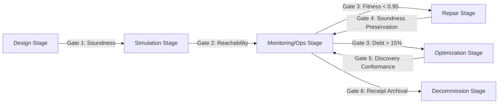

# Lifecycle: Define Blue River Dam Lifecycle Gate Map

This document establishes the official quality gates governing transition admissibility across the process lifecycle stages under the jurisdiction of the **Blue River Dam Doctrine**.

---

## The Six Quality Gates

### Gate 1: Design State (Structural Soundness Gate)
* **Goal**: Ensure the designed process model contains no structural flaws before resources are spent on simulation.
* **Criterion**: The Petri Net $N = (P, T, F)$ must be a verified Workflow Net (WF-net) and satisfy classical soundness.
* **Verification Equation**:
  $$\operatorname{sound}(N) \equiv \operatorname{true}$$
  where:
  1. $\exists! i \in P \text{ s.t. } \bullet i = \emptyset$ and $\exists! o \in P \text{ s.t. } o \bullet = \emptyset$.
  2. $\overline{N} = (P, T \cup \{t^*\}, F \cup \{(o, t^*), (t^*, i)\})$ is strongly connected.
  3. $\forall M \in [N, i\rangle, \quad o \in [N, M\rangle \land (M \ge o \implies M = o)$.
  4. $\forall t \in T, \exists M \in [N, i\rangle, \quad M \stackrel{t}{\to}$.

### Gate 2: Simulation State (Behavioral Bounds Gate)
* **Goal**: Validate model behavior under simulated load and verify state-space boundedness.
* **Criterion**: Reachability analysis of $RG(N, i)$ must verify that the net is 1-bounded (safe) and contains no deadlocks.
* **Verification Equation**:
  $$\forall M \in [N, i\rangle, \quad \left( \sum_{p \in P} M(p) \ge 1 \right) \land \left( M \neq o \implies |\{t \in T \mid M \stackrel{t}{\to}\}| \ge 1 \right)$$
  In addition, queueing lengths estimated via Little's Law must satisfy budget constraints: $L_{est} \le L_{max}$.

### Gate 3: Monitoring & Operations State (Conformance Admissibility Gate)
* **Goal**: Validate that live execution traces conform to the approved process model.
* **Criterion**: Live traces must exceed the board-established alignment fitness boundary ($\theta_{\text{fit}} \ge 0.95$). If a trace $\sigma$ falls below this threshold, it is rejected unless an Executive Board override signature is verified.
* **Verification Equation**:
  $$\operatorname{admissible}(\sigma) \iff \operatorname{fitness}(\sigma, N) \ge 0.95 \lor \left(\operatorname{fitness}(\sigma, N) \ge 0.85 \land \operatorname{override}(\sigma)\right)$$
  where $\operatorname{override}(\sigma) \implies \text{Sign}_{\text{Board}}(\operatorname{hash}(\sigma))$. Under no circumstances is a trace with fitness $< 0.85$ admitted.

### Gate 4: Repair State (Soundness Preservation Gate)
* **Goal**: Ensure that automatic or manual process repairs do not introduce deadlocks or structural flaws.
* **Criterion**: Repaired model $N'$ must be proven sound, and the repairs must be isolated to targeted S-components.
* **Verification Equation**:
  $$\operatorname{sound}(N') \equiv \operatorname{true} \land N_{s}' = \operatorname{repair}(N_s)$$
  where $N_s$ is the isolated S-component of $N$, preserving the behavior of the rest of the net $N \setminus N_s$.

### Gate 5: Optimization State (Efficiency & Discovery Gate)
* **Goal**: Restructure process models to eliminate process debt while preserving conformance.
* **Criterion**: The discovered model $N_{opt}$ must have a lower process debt $D_p$ than the active model, and must be generated via the Inductive Miner to guarantee block-structured soundness.
* **Verification Equation**:
  $$D_p(N_{opt}) < D_p(N_{active}) \quad \text{and} \quad \operatorname{discover}(L) \to \text{Process Tree (POWL)}$$

### Gate 6: Decommissioning State (Auditable Archival Gate)
* **Goal**: Safely retire the process and generate an auditable final trace receipt.
* **Criterion**: The execution runtime must be disabled, and a Cryptographic Decommissioning Receipt must be generated, signed, and registered in the compliance ledger.
* **Verification Equation**:
  $$\operatorname{active}(N) \equiv \operatorname{false} \land \operatorname{verify\_receipt}(R_d) \equiv \operatorname{true}$$

---

## Related Documents
* Review the central [Blue River Dam Doctrine](file:///Users/sac/process-intelligence/doctrine/blue-river-dam.md) for executive authorities.
* Review [Autonomic Knowledge Actuation Map](file:///Users/sac/process-intelligence/lifecycle/define_autonomic_knowledge_actuation_map.md) for loop mappings.
* Back to [Lifecycle README](file:///Users/sac/process-intelligence/lifecycle/docs-law__lifecycle_readme.md).