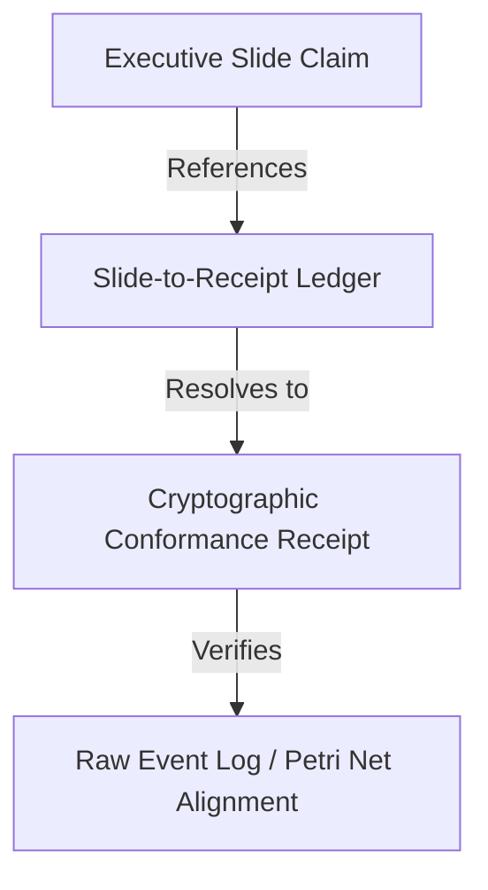

# Lifecycle: Define Board-Projection-State Process Intelligence

The **Board Projection State** governs the translation of low-level process mining conformance data, performance logs, and structural analysis into executive, board-level projections and slide decks.

## Autonomic MAPE-K Mapping
* **Loop Role**: **Knowledge** (presentation and translation of intelligence)
* **Responsibility**: In the Knowledge phase, raw technical metrics are aggregated and converted into financial and operational metrics (e.g. cost savings, risk exposure, integration speed) while maintaining a strict, unbroken trail of evidence.
* **Actuation Trigger**: Initiated when preparing diligence materials for potential buyers, executive boards, or external auditors.

---

## Slide-to-Receipt Mapping Framework

To eliminate fraudulent or exaggerated operational claims in executive presentations, the foundry enforces **Slide-to-Receipt Mapping**:



### 1. The Slide-to-Receipt Ledger
A central ledger cataloging every executive slide claim. Each record in the ledger contains:
* **Claim ID**: Unique identifier (e.g., `CLAIM_O2C_089`).
* **Slide Number & Deck Hash**: Identifies the source presentation.
* **Asserted Value**: The metric claimed (e.g., "18% reduction in bottleneck delays").
* **Receipt ID**: The cryptographic receipt generated by the process mining engine proving this claim.
* **Execution Query**: The OCPQ or SQL query that produced the underlying numbers from the raw logs.

### 2. JSON-LD Metadata Embeddings
Every executive slide deck must contain a hidden JSON-LD metadata block for each claim:
```json
{
  "@context": "https://foundry.process-intelligence.org/schemas/claim.jsonld",
  "@type": "ExecutiveClaim",
  "claimId": "CLAIM_O2C_089",
  "assertion": "18% bottleneck reduction in procurement",
  "receiptHash": "sha256:e3b0c44298fc1c149afbf4c8996fb92427ae41e4649b934ca495991b7852b855",
  "verifiedBy": "VerificationCourt_Oracle_01",
  "query": "SELECT bottleneck_reduction FROM optimization_runs WHERE run_id = 'opt_098_proc'"
}
```

---

## M&A Due Diligence Claims
In M&A, Board Projections are the **Diligence Baseline** that buyers use to justify acquisition multiples.
* **Buyer Reliance**: The buyer relies on these projections for post-close integration budgets. Under the Blue River Dam Doctrine, the seller is legally liable for the accuracy of these projections, which must be backed by the verification ledger.
* **Slide-to-Receipt Map**: If a pitch deck slide states "Post-acquisition, we will capture $5M in procurement synergies," the slide must link to a ledger entry proving that this synergy was simulated (see [Simulation Stage](file:///Users/sac/process-intelligence/lifecycle/define_simulation-state_process_intelligence.md)) using the target's actual logs and showing a sound post-merger net design.

---

## Related Documents
* See the [False-Claim Taxonomy](file:///Users/sac/process-intelligence/lifecycle/define_false-claim_taxonomy.md) to detect presentation fraud.
* See the [Final Receipt State](file:///Users/sac/process-intelligence/lifecycle/define_final_receipt_state.md) for the cryptographic layout.
* Back to [Lifecycle README](file:///Users/sac/process-intelligence/lifecycle/docs-law__lifecycle_readme.md).