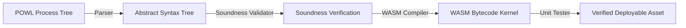

# Lifecycle: Define Construction-State Process Intelligence

The **Construction State** governs the compilation, packaging, and unit-testing of process models into executable software assets (WASM kernels) prior to activation.

## Autonomic MAPE-K Mapping
* **Loop Role**: **Plan** & **Execute**
* **Responsibility**: In the Plan phase, the abstract process tree (POWL) is compiled into concrete execution structures. In the Execute phase, static unit tests are run against the compiled WASM kernel to verify token game compliance.
* **Actuation Trigger**: Initiated automatically when a designed or repaired model passes the **Design Stage** gates and is queued for deployment.

---

## The Compilation and Packaging Pipeline

The construction process compiles process models into high-performance execution modules:

### 1. Model Parsing & AST Representation
The input process tree (POWL) or Petri Net JSON is parsed into an Abstract Syntax Tree (AST) that represents the operational blocks (sequence, choice, loop, parallel).

### 2. Static Soundness Check
Before compilation, the compiler runs static checks (WF-net connectivity, place/transition flow checks) to ensure that the code structure cannot represent an unsound process.

### 3. WASM Compilation (`wasm4pm`)
The AST is compiled into a WebAssembly (WASM) binary:
* The state of the process is represented as a compact bit-vector.
* Firing a transition is implemented as an atomic bitwise operation (e.g. subtracting tokens from inputs, adding tokens to outputs).
* This provides sub-microsecond transition checks, permitting real-time transaction enforcement.

### 4. Unit Test Generation
The compiler automatically generates synthetic unit tests (token game fixtures) to verify:
* **Happy Paths**: Firing transitions from $i \to o$ compiles correctly.
* **Boundary Exceptions**: Attempting to fire an disabled transition throws a controlled `RuntimeException` (which will be handled by the autonomic monitoring layer).

---

## M&A Diligence Claims
In M&A, the Construction State represents the **Enforceability Proof**.
* **Buyer Reliance**: The buyer relies on construction logs to verify that the target's operational rules are hard-coded and system-enforced, preventing employees or legacy systems from bypassing compliance boundaries.
* **Slide-to-Receipt Map**: PowerPoint claims asserting "Our risk management rules are compiled and hard-enforced in real-time" must link to the Construction State receipt containing the compiled WASM kernel hash and unit test logs.

---

## Related Documents
* See the [Design Stage](file:///Users/sac/process-intelligence/lifecycle/define_design-state_process_intelligence.md) for structural baselines.
* See the [Activation Stage](file:///Users/sac/process-intelligence/lifecycle/define_activation-state_process_intelligence.md) for endpoint binding.
* Back to [Lifecycle README](file:///Users/sac/process-intelligence/lifecycle/docs-law__lifecycle_readme.md).