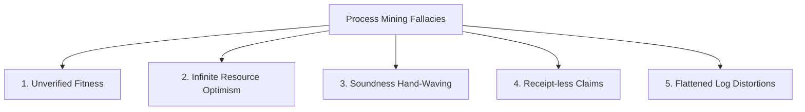

# Lifecycle: Define False-Claim Taxonomy

The **False-Claim Taxonomy** defines the standardized categories of misleading, unverified, or structurally indefensible claims frequently encountered in process mining reports, executive pitch decks, and M&A due diligence packages.

## Taxonomy of Process Mining Fallacies

The framework classifies process mining fallacies into five major categories:

### 1. Unverified Fitness Claims
* **Description**: Asserting high process compliance (e.g. "99% compliance") using superficial heuristics instead of formal alignment conformance.
* **Misleading Method**: Calculating fitness by simply matching task lists without checking sequence order, concurrency constraints, or counting missing/remaining tokens.
* **Foundry Defense**: Replay event logs using $A^*$ alignment conformance. Assert that any fitness claim must resolve to:
  $$\operatorname{fitness}(L, N) = 1 - \frac{\operatorname{cost}(\sigma, \gamma_{opt})}{\operatorname{worst-cost}(\sigma, N)}$$

### 2. Infinite Resource Optimism
* **Description**: Projecting massive cycle-time or throughput gains from process redesign without accounting for finite resource capacity.
* **Misleading Method**: Redesigning a process on paper by removing approval tasks, assuming that other employees can handle the diverted workload instantly without creating queue bottlenecks.
* **Foundry Defense**: Enforce queue-length checks using Little's Law ($L = \lambda W$) during the [Simulation Stage](file:///Users/sac/process-intelligence/lifecycle/define_simulation-state_process_intelligence.md). Reject any design optimization where resource utilization exceeds 95%.

### 3. Soundness Hand-Waving
* **Description**: Presenting BPMN workflows or Petri Nets as "fully optimized" or "ready for automated execution" without verifying soundness.
* **Misleading Method**: Ignoring potential deadlocks, livelocks, or unbounded token generation, which will cause live WASM execution kernels to crash.
* **Foundry Defense**: Reject models at the [Design Stage](file:///Users/sac/process-intelligence/lifecycle/define_design-state_process_intelligence.md) that do not pass the automated `assert_soundness` checkpoint.

### 4. Receipt-less Performance Claims
* **Description**: Presenting operational statistics (e.g., "Invoice processing cost reduced by $12 per case") that are not linked to verifiable event logs.
* **Misleading Method**: Fabricating or manually altering Excel reports without keeping the underlying XES/OCEL event files.
* **Foundry Defense**: Require every claim in a board presentation to reference a cryptographic receipt hash (see [Board Projection State](file:///Users/sac/process-intelligence/lifecycle/define_board-projection-state_process_intelligence.md)).

### 5. Flattened Log Distortions
* **Description**: Masking structural inefficiencies by flattening multi-object event data into standard single-case logs.
* **Misleading Method**: Artificial duplication of events when mapping an order with multiple items and payments to a flat XES structure, which inflates fitness scores and distorts activity counts.
* **Foundry Defense**: Enforce OCEL 2.0 object-centric validation, preserving exact relationships between events and multiple distinct object types.

---

## M&A Diligence Enforcement

In M&A due diligence, the False-Claim Taxonomy serves as the **Auditor's Code of Refusal**:
* **Refusal Rules**: Diligence teams must automatically flag and reject any seller presentation containing claims that fall into these taxonomy categories.
* **Legal Warranty**: Sellers are required to warrant that all presented operational metrics are free from these five fallacies, backed by the slide-to-receipt registry.

---

## Related Documents
* See the [Board Projection State](file:///Users/sac/process-intelligence/lifecycle/define_board-projection-state_process_intelligence.md) for verification procedures.
* See the [Audit Lifecycle Completeness](file:///Users/sac/process-intelligence/lifecycle/audit__lifecycle_completeness.md) checklist.
* Back to [Lifecycle README](file:///Users/sac/process-intelligence/lifecycle/docs-law__lifecycle_readme.md).