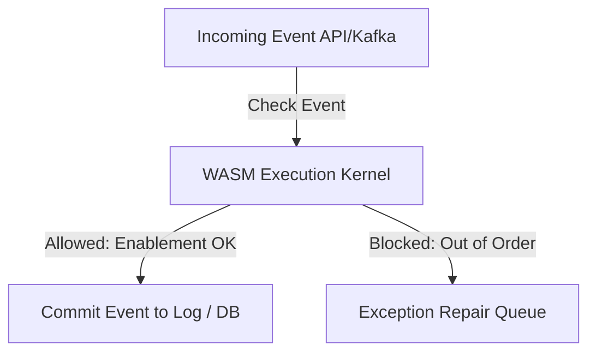

# Lifecycle: Define Operation-State Process Intelligence

The **Operation State** is the active execution phase where the process is running in production, processing live business transactions, and streaming execution logs.

## Autonomic MAPE-K Mapping
* **Loop Role**: **Monitor** & **Execute**
* **Responsibility**: In the Monitor phase, the engine ingests real-time events and calculates streaming KPIs. In the Execute phase, it acts as an active gatekeeper, blocking non-conforming transaction steps and routing exceptions to repair queues.
* **Actuation Trigger**: Activated immediately after passing the **Activation State** checks and initialization protocols.

---

## Operations Architecture & Transaction Enforcement

Operating processes require active enforcement to prevent operational drift:

### 1. The Streaming Event Ingestion
Production systems (e.g., Salesforce, SAP, custom backends) publish events to an ingestion bus (e.g., Apache Kafka). The operation-state engine listens to these topics and transforms events into the structured XES/OCEL format.

### 2. Active Transaction Gatekeeping
For processes requiring high compliance (e.g., financial transactions, healthcare consent), the operation-state engine acts as an inline proxy:
* Before a transaction step $A$ is committed to the database, the system queries the active WASM process kernel.
* If transition $A$ is enabled under the current case marking, the transaction is approved, the marking is updated, and the event is committed.
* If transition $A$ is disabled, the transaction is blocked, returning a compliance exception to the calling application, and the event metadata is routed to the **Repair Stage**.

### 3. Operational Performance Tracking
During operation, the engine maintains rolling performance indexes:
* **Case Throughput Time** ($T_c$): Total time elapsed from source place to sink place.
* **Activity Processing Time** ($T_p$): Time spent inside a single transition's active execution.
* **Resource Cost Index**: Tracking operational expenses per transaction.

---

## M&A Diligence Claims
In M&A, the Operation State provides the **Live Performance Proof**.
* **Buyer Reliance**: The buyer relies on operational metrics to verify that the target company is currently operating at the stated efficiency and compliance levels.
* **Slide-to-Receipt Map**: PowerPoint assertions claiming "Our order execution engine operates with a 24-hour average cycle time" must link to the Operation State dashboard, which independently calculates the cycle time from the live event stream.

---

## Related Documents
* See the [Activation Stage](file:///Users/sac/process-intelligence/lifecycle/define_activation-state_process_intelligence.md) for pre-operational setups.
* See the [Monitoring Stage](file:///Users/sac/process-intelligence/lifecycle/define_monitoring-state_process_intelligence.md) for conformance calculations.
* Back to [Lifecycle README](file:///Users/sac/process-intelligence/lifecycle/docs-law__lifecycle_readme.md).