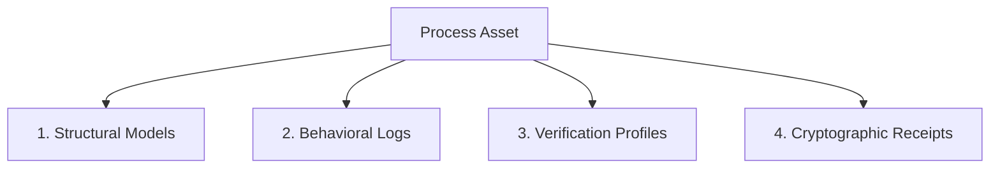

# Lifecycle: Define Process Asset Taxonomy

The **Process Asset Taxonomy** provides a standardized classification system for all structural, behavioral, and verification artifacts generated and maintained across the process intelligence lifecycle.

## Classifications of Process Assets

All process assets are categorized into four distinct classes:

### 1. Structural Models
These assets define the intended flow and constraints of the process:
* **BPMN 2.0 XML**: Business-level visual workflow definitions.
* **Petri Net JSON**: Mathematically defined place-transition models used for formal soundness checks.
* **POWL Process Trees**: Block-structured syntax representations that guarantee soundness by design.
* **WASM Kernels (`.wasm`)**: Compiled execution bytecode modules compiled via the `wasm4pm` compiler for live enforcement.

### 2. Behavioral Logs
These assets record the actual historical execution of the process:
* **Raw Transaction Dumps**: Unstructured database audit tables from ERP/CRM systems.
* **XES Files (`.xes`, `.xes.gz`)**: Standardized flat event streams mapping events to case IDs.
* **OCEL 2.0 SQLite Databases (`.db`)**: Relational object-centric event logs capturing multi-entity relationships.
* **OCEL Parquet Columnar Files (`.parquet`)**: Compressed cold-storage event streams optimized for high-performance query audits.

### 3. Verification Profiles
These assets document the pre-execution checks and simulation models:
* **Reachability Graph JSON**: State-space graphs generated during simulation to prove safety and deadlock-free operation.
* **Monte Carlo Configurations**: Distribution files defining task durations and resource costs.
* **Queueing Models**: Little's Law parameters mapping resource capacities to throughput estimations.

### 4. Cryptographic Receipts
These assets represent the audit proofs validating process actions:
* **Activation Receipt**: Signed metadata containing the WASM hash and live Kafka topic bindings.
* **Alignment Conformance Receipt**: Verification court output detailing trace fitness ($f \ge 0.95$) and precision scores.
* **Decommissioning Receipt ($R_d$)**: Signed SHA-256 hashes certifying the safe deactivation of a process.

---

## M&A Valuation of Process Assets

In M&A transactions, process assets represent the **Operational Intellectual Property (IP)** of the company:
* **Asset Audits**: Buyers review the asset taxonomy to verify that the target's processes are documented in standard, machine-readable formats, rather than relying on informal PDF manuals.
* **Valuation Impact**: Standardized, WASM-compiled process assets reduce integration costs and increase the valuation multiple of the target.

---

## Related Documents
* Stage details: [Design Stage](file:///Users/sac/process-intelligence/lifecycle/define_design-state_process_intelligence.md) | [Simulation Stage](file:///Users/sac/process-intelligence/lifecycle/define_simulation-state_process_intelligence.md) | [Monitoring Stage](file:///Users/sac/process-intelligence/lifecycle/define_monitoring-state_process_intelligence.md) | [Repair Stage](file:///Users/sac/process-intelligence/lifecycle/define_repair-state_process_intelligence.md) | [Optimization Stage](file:///Users/sac/process-intelligence/lifecycle/define_optimization-state_process_intelligence.md) | [Decommissioning Stage](file:///Users/sac/process-intelligence/lifecycle/define_decommission-state_process_intelligence.md)
* Back to [Lifecycle README](file:///Users/sac/process-intelligence/lifecycle/docs-law__lifecycle_readme.md).