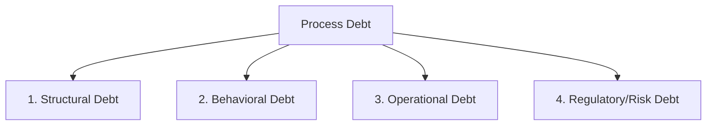

# Lifecycle: Define Process Debt Taxonomy

The **Process Debt Taxonomy** provides a standardized classification system for identifying, measuring, and managing structural and operational inefficiencies in enterprise process models.

## Categories of Process Debt

Process debt is classified into four primary categories:

### 1. Structural Debt
Structural debt refers to unnecessary complexity in the process model design:
* **Spaghetti Structures**: High density of transitions and places with multiple intersecting paths, making the model difficult to maintain.
* **Redundant Tau Transitions**: Excessive silent routing steps that do not correspond to business activities but exist only to bypass structural limitations.
* **Non-Block Structures**: Petri Nets that cannot be parsed into clean, block-structured process trees (POWL), complicating automated optimization.

### 2. Behavioral / Conformance Debt
Behavioral debt is the gap between designed procedures and actual execution, measured via conformance checks:
* **Trace Deviations**: Mismatches between event logs and model rules, indicating that employees are bypassing standard procedures.
* **Low Replay Fitness**: A conformance score $f_{align} < 0.95$, representing systemic process drift.
* **Manual Override Reliance**: Frequent activation of cryptographic override keys, showing that the model is too rigid for actual operations.

### 3. Operational Debt (Bottlenecks)
Operational debt represents the performance cost of inefficient process execution:
* **Resource Starvation**: Tasks blocked because shared resources (e.g. key personnel, systems) are over-allocated.
* **Queue Latency**: Delay costs modeled via Little's Law ($L = \lambda W$), where bottlenecks increase case throughput times.
* **Redundant Loop Waste**: Cases cycling through the same approval or correction loops multiple times due to poor quality control.

### 4. Regulatory & Risk Debt
Regulatory debt represents compliance exposure:
* **Lack of Receipts**: Active execution paths running without generating conformance logs or cryptographic receipts.
* **Segregation of Duty (SoD) Violations**: Failure to enforce that distinct tasks (e.g. order approval and invoice payment) are performed by different resources.

---

## Process Debt Quantification Formula

We calculate the total **Process Debt** ($D_p$) of a process model $N$ on event log $L$ as:
$$D_p = \sum_{c \in L} \left( C_{deviate}(c) + C_{delay}(c) + C_{overhead}(c) \right)$$
where:
* $C_{deviate}(c)$ is the cost of trace deviations, calculated as:
  $$C_{deviate}(c) = (1 - \operatorname{fitness}(c, N)) \times \text{Cost}_{\text{audit\_penalty}}$$
* $C_{delay}(c)$ is the financial cost of queue delays calculated from the case throughput time.
* $C_{overhead}(c)$ is the cost of executing unnecessary or redundant tasks.

---

## M&A Due Diligence Implications

In M&A, Process Debt represents a **Post-Close Integration Liability**:
* **Buyer Liability**: The buyer must invest capital to refactor the target's systems and retrain employees to eliminate process debt.
* **Valuation Impact**: High process debt ($D_p > 15\%$ of operating cost) serves as a key lever for negotiating down the purchase price of the target company.

---

## Related Documents
* See the [Optimization Stage](file:///Users/sac/process-intelligence/lifecycle/define_optimization-state_process_intelligence.md) for how process debt is eliminated.
* See the [False-Claim Taxonomy](file:///Users/sac/process-intelligence/lifecycle/define_false-claim_taxonomy.md) to detect hidden debt.
* Back to [Lifecycle README](file:///Users/sac/process-intelligence/lifecycle/docs-law__lifecycle_readme.md).