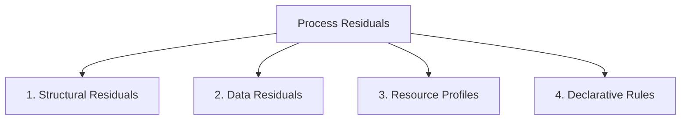

# Lifecycle: Define Process Residual Taxonomy

The **Process Residual Taxonomy** classifies the types of operational value, knowledge, and assets harvested from a process model upon its decommissioning.

## Types of Process Residuals

When a process is decommissioned, it is not merely deleted; instead, its valuable components are harvested and categorized:

### 1. Structural Residuals
Reusable design patterns harvested from the retired process tree (POWL) or Petri Net:
* **Sub-Tree Blocks**: Reusable sequence ($\rightarrow$) or choice ($\times$) sub-structures that successfully handled complex tasks.
* **Bypass Routing Subnets**: Repaired structures that proved highly efficient in production and can be incorporated as standard paths in new designs.

### 2. Data Residuals
Historical event logs and performance statistics that serve as baselines:
* **Benchmark Logs**: Final OCEL 2.0 archives that record case durations, transaction volumes, and cost distributions.
* **Duration Metrics**: Empirical distributions of task durations that are fed into future simulation engines.

### 3. Resource Competence Profiles
Operational capability metadata derived from resource activities:
* **Activity-Resource Mapping**: Records of which employees or system APIs performed specific tasks with the lowest processing and delay times.
* **Capacity baselines**: Empirical records of resource availability and queue limits, preventing over-allocation in future designs.

### 4. Declarative Rules & Constraints
Business logic captured during the process lifecycle:
* **Declarative Constraints**: Linear Temporal Logic (LTL) rules that were successfully enforced (e.g., "Activity $B$ must always follow Activity $A$").
* **Guard Conditions**: Validated data thresholds (e.g. "Order approval required only if amount $> \$10,000$") derived from historical decisions.

---

## M&A Harvest Value

In M&A, the Process Residual Taxonomy defines the **Salvage Value** of legacy systems:
* **Buyer Ingestion**: When retiring an acquired company's redundant legacy CRM, the buyer harvests the CRM's process residuals (especially resource profiles and benchmark logs) to optimize the buyer's own CRM.
* **Intellectual Property Preservation**: It ensures that decades of operational learning are not lost during post-merger integration.

---

## Related Documents
* See the [Decommissioning Stage](file:///Users/sac/process-intelligence/lifecycle/define_decommission-state_process_intelligence.md) for harvesting triggers.
* See the [Archive State](file:///Users/sac/process-intelligence/lifecycle/define_archive-state_process_intelligence.md) for long-term storage.
* Back to [Lifecycle README](file:///Users/sac/process-intelligence/lifecycle/docs-law__lifecycle_readme.md).