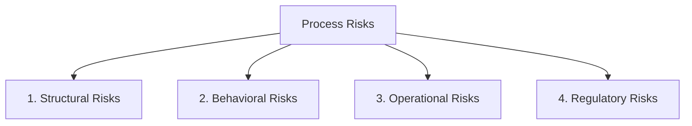

# Lifecycle: Define Process Risk Taxonomy

The **Process Risk Taxonomy** provides a standardized classification for identifying, quantifying, and mitigating risks associated with process structure and execution.

## Classifications of Process Risk

Process risks are divided into four primary domains:

### 1. Structural Risks
Risks inherent in the model topology:
* **Deadlock Risk**: The probability that a case enters a marking $M$ where no transitions are enabled, and the sink place $o$ is empty ($M(o) = 0$).
* **Livelock (Infinite Loop) Risk**: The risk that a case becomes trapped in a cycle of silent or redundant transitions, preventing proper completion.
* **Unboundedness (Token Accumulation) Risk**: The possibility of accumulating infinite tokens in a place, representing memory overflows or system freezes in the execution core.

### 2. Behavioral Risks
Risks arising from human or system interaction:
* **Process Drift**: The gradual divergence between the approved process model and the actual event paths recorded in execution logs.
* **Compliance Deficit**: Operating under a low alignment fitness score ($f_{align} < 0.90$), indicating systemic deviations.
* **Bypass Vulnerabilities**: The ease with which users can bypass verification checks due to incomplete API or database enforcement.

### 3. Operational Risks
Performance-related execution risks:
* **Resource Starvation**: High processing delays caused by a lack of available resource roles, leading to queue build-up.
* **SLA Violations**: Cycle times exceeding contractually mandated service levels, leading to business penalties.
* **Single Point of Failure (Symmetric Lock)**: A process block that requires a single, specific resource to proceed, halting the entire workflow if that resource is offline.

### 4. Regulatory Risks
Legal and audit exposure risks:
* **Segregation of Duty (SoD) Violations**: A single individual initiating and approving the same transaction (e.g. creating and paying a purchase order).
* **Missing Audit Trails**: Executing business processes without registering standard event logs (XES/OCEL) or generating cryptographic receipts, rendering the process unauditable.

---

## Risk Assessment & M&A Diligence

In M&A, the Process Risk Taxonomy is used to build the **Operational Risk Ledger**:
* **Quantification**: Auditors multiply the probability of a risk (e.g. deadlock probability calculated from reachability graphs) by the financial impact of a system halt to calculate the Expected Risk Value.
* **Mitigation Verification**: Buyers verify that processes have automated mitigation loops (such as the autonomic **Repair Stage**) to protect the investment from post-acquisition operational freezes.

---

## Related Documents
* See the [Monitoring Stage](file:///Users/sac/process-intelligence/lifecycle/define_monitoring-state_process_intelligence.md) for risk detection.
* See the [Repair Stage](file:///Users/sac/process-intelligence/lifecycle/define_repair-state_process_intelligence.md) for automated risk mitigation.
* Back to [Lifecycle README](file:///Users/sac/process-intelligence/lifecycle/docs-law__lifecycle_readme.md).