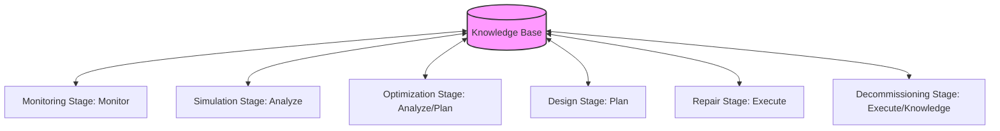

# Process Lifecycle Framework: Docs-Law README

This document serves as the central authority for the process lifecycle framework within the Process Intelligence Research Foundry. It governs how process models transition across stages under autonomic control, ensuring that all transformations are mathematically sound, standards-compliant, and board-defensible for M&A due diligence.

## The Autonomic Feedback Loop (MAPE-K)

Rather than treating process models as static flowcharts, this framework models processes as active, self-regulating feedback systems based on the autonomic **MAPE-K (Monitor, Analyze, Plan, Execute, Knowledge)** loop. The six process lifecycle stages map directly to this loop:

1. **Design Stage** maps to **Knowledge & Plan**: Defining formal structures (Petri nets, BPMN, POWL) and declaring target behavioral laws.
2. **Simulation Stage** maps to **Analyze**: Performing dry-run state-space coverability checks, calculating bottleneck probabilities, and executing token replays before live activation.
3. **Monitoring Stage** maps to **Monitor**: Ingesting event logs (XES, OCEL 2.0) and tracking conformance metrics (fitness, precision, generalizations) in real-time.
4. **Repair Stage** maps to **Execute**: Dynamically modifying process paths or model structures to resolve deadlocks and non-conformances.
5. **Optimization Stage** maps to **Analyze & Plan**: Running Inductive Mining algorithms to reformulate process structures, eliminating process debt and enhancing throughput.
6. **Decommissioning Stage** maps to **Execute & Knowledge**: Archiving historical execution states, extracting residual patterns, and issuing cryptographic final decommissioning receipts.

---

## Academic Canon Alignment

All lifecycle activities must strictly align with the formal principles established in the process mining literature:
* **Workflow Net Soundness (van der Aalst 1998/2016)**: Proving that WF-nets have a unique source, a unique sink, and satisfy liveness (no deadlocks) and boundedness (safe token placement).
* **Alignment-Based Conformance (Adriansyah 2014)**: Computing optimal alignments between event logs and Petri nets, minimizing the mismatch cost via $A^*$ search.
* **Block-Structured Discovery (Leemans 2013)**: Guaranteeing soundness during optimization by utilizing the Inductive Miner to discover block-structured process trees (POWL).
* **Object-Centric Audits (Ghahfarokhi 2021)**: Capturing multi-entity relationships and shared resources via the Object-Centric Event Log (OCEL 2.0) standard.

---

## M&A-Ready Slide-to-Receipt Mapping

For board-level and buyer due diligence, operational claims must be backed by reproducible cryptographic receipts. This repository enforces that every slide assertion (e.g., "Operational efficiency improved by 18%") resolves to a verifiable process mining receipt containing the raw log query, the alignment cost matrix, and the mathematical soundness proof of the optimized model.

---

## Lifecycle Document Registry

All stages, taxonomies, and audit protocols are detailed in the following documents. These absolute links do not use backticks on the link text, maintaining direct referential integrity:

### Lifecycle Stages
* [define_design-state_process_intelligence.md](file:///Users/sac/process-intelligence/lifecycle/define_design-state_process_intelligence.md) - Formal design and soundness constraints.
* [define_simulation-state_process_intelligence.md](file:///Users/sac/process-intelligence/lifecycle/define_simulation-state_process_intelligence.md) - Pre-execution validation and state space exploration.
* [define_monitoring-state_process_intelligence.md](file:///Users/sac/process-intelligence/lifecycle/define_monitoring-state_process_intelligence.md) - Conformance replay and real-time metric capture.
* [define_repair-state_process_intelligence.md](file:///Users/sac/process-intelligence/lifecycle/define_repair-state_process_intelligence.md) - Automated structural repair and exception routing.
* [define_optimization-state_process_intelligence.md](file:///Users/sac/process-intelligence/lifecycle/define_optimization-state_process_intelligence.md) - Inductive discovery and process debt reduction.
* [define_decommission-state_process_intelligence.md](file:///Users/sac/process-intelligence/lifecycle/define_decommission-state_process_intelligence.md) - Transition to archive and final receipt generation.

### Autonomic & Gate Controls
* [define_autonomic_knowledge_actuation_map.md](file:///Users/sac/process-intelligence/lifecycle/define_autonomic_knowledge_actuation_map.md) - MAPE-K orchestration parameters.
* [define_blue_river_dam_lifecycle_gate_map.md](file:///Users/sac/process-intelligence/lifecycle/define_blue_river_dam_lifecycle_gate_map.md) - Quality gates for stage transitions.
* [define_final_receipt_state.md](file:///Users/sac/process-intelligence/lifecycle/define_final_receipt_state.md) - Cryptographic verification receipt standard.

### Supporting States
* [define_acquisition-state_process_intelligence.md](file:///Users/sac/process-intelligence/lifecycle/define_acquisition-state_process_intelligence.md) - Pre-merger target ingestion.
* [define_construction-state_process_intelligence.md](file:///Users/sac/process-intelligence/lifecycle/define_construction-state_process_intelligence.md) - Petri Net compilation and WASM packaging.
* [define_activation-state_process_intelligence.md](file:///Users/sac/process-intelligence/lifecycle/define_activation-state_process_intelligence.md) - Deploying models to live messaging queues.
* [define_integration-state_process_intelligence.md](file:///Users/sac/process-intelligence/lifecycle/define_integration-state_process_intelligence.md) - Alignment with global enterprise architectures.
* [define_operation-state_process_intelligence.md](file:///Users/sac/process-intelligence/lifecycle/define_operation-state_process_intelligence.md) - Active execution run-times.
* [define_archive-state_process_intelligence.md](file:///Users/sac/process-intelligence/lifecycle/define_archive-state_process_intelligence.md) - Storage optimization and cold data strategies.
* [define_board-projection-state_process_intelligence.md](file:///Users/sac/process-intelligence/lifecycle/define_board-projection-state_process_intelligence.md) - Executive dashboard translation rules.

### Taxonomies & Audits
* [define_process_asset_taxonomy.md](file:///Users/sac/process-intelligence/lifecycle/define_process_asset_taxonomy.md) - Categorizing logs, models, and metadata.
* [define_process_debt_taxonomy.md](file:///Users/sac/process-intelligence/lifecycle/define_process_debt_taxonomy.md) - Structural, behavioral, and operational debt.
* [define_process_readiness_taxonomy.md](file:///Users/sac/process-intelligence/lifecycle/define_process_readiness_taxonomy.md) - Operational maturity levels.
* [define_process_residual_taxonomy.md](file:///Users/sac/process-intelligence/lifecycle/define_process_residual_taxonomy.md) - Retained value of decommissioned assets.
* [define_process_risk_taxonomy.md](file:///Users/sac/process-intelligence/lifecycle/define_process_risk_taxonomy.md) - Quantifying process vulnerabilities.
* [define_false-claim_taxonomy.md](file:///Users/sac/process-intelligence/lifecycle/define_false-claim_taxonomy.md) - Identifying and refusing hand-waving M&A assertions.
* [audit__lifecycle_completeness.md](file:///Users/sac/process-intelligence/lifecycle/audit__lifecycle_completeness.md) - Complete audit checklist.
* [checkpoint__lifecycle_model_complete.md](file:///Users/sac/process-intelligence/lifecycle/checkpoint__lifecycle_model_complete.md) - State-specific validation assertions.

---

## Section 1: The Evidence Lifecycle (v30.1.1 Spec)

The central structural invariant of the process-evidence lifecycle is a typed, one-way door. The lifecycle is a directed state machine over the set of stage tokens:
$$\mathcal{S} = \{\texttt{Raw}, \texttt{Parsed}, \texttt{Admitted}, \texttt{Refused}, \texttt{Projected}, \texttt{Exportable}, \texttt{Receipted}\}$$
with initial state $\texttt{Raw}$ and terminal states $\{\texttt{Refused}, \texttt{Receipted}\}$.

The lawful transitions are:
$$\texttt{Raw} \xrightarrow{\texttt{into\_parsed}} \texttt{Parsed} \xrightarrow{\texttt{Admit::admit}} \texttt{Admitted} \to \begin{cases} 
\texttt{Projected} \xrightarrow{\texttt{into\_receipted}} \texttt{Receipted} \\ 
\texttt{Exportable} \xrightarrow{\texttt{into\_receipted}} \texttt{Receipted} \\ 
\texttt{Receipted} \quad \text{(terminal)} 
\end{cases}$$

Refuse paths are available before admission:
$$\texttt{Raw} \xrightarrow{\texttt{refuse}} \texttt{Refused}, \qquad \texttt{Parsed} \xrightarrow{\texttt{into\_refused}} \texttt{Refused}$$

Type-level safety enforces that cross-state substitution is a compiler error:
$$\forall T, S_1, S_2, W. \quad S_1 \neq S_2 \implies \text{Evidence}\langle T, S_1, W \rangle \not\leq \text{Evidence}\langle T, S_2, W \rangle$$