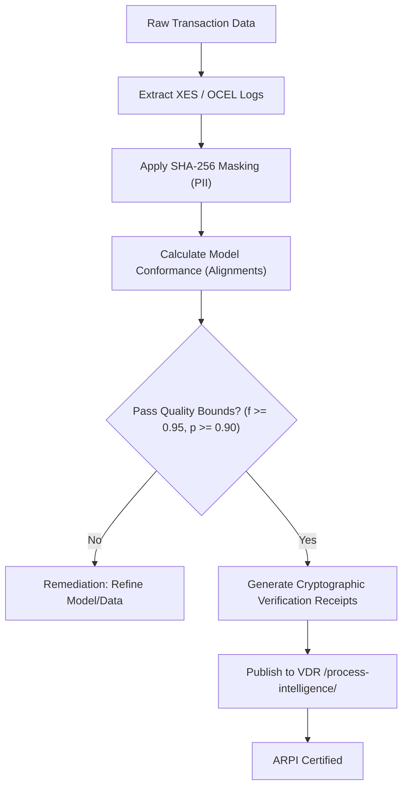

# Acquisition-Ready Process Intelligence

Acquisition-Ready Process Intelligence (ARPI) defines the state in which a target company's operational processes, transactional event logs, and compliance models are fully documented, verified, and structured for buyer due diligence. Achieving ARPI status guarantees that process disclosures are transaction-safe, audit-defensible, and immediately consumable by the buyer's advisory team.

## 1. ARPI Conformance and Quality Thresholds

To be certified as "Acquisition-Ready," the target's process models and event logs must meet the following four criteria:

### A. Operational Coverage Bound
* **Log Completeness**: Event logs must capture at least 98% of all completed transactions (by volume and value) for core operational loops (Order-to-Cash, Procure-to-Pay, and Record-to-Report).
* **Data Horizon**: A minimum of 12 consecutive months of historical event data is required, ensuring that seasonal variations and quarterly closings are fully captured.

### B. Mathematical Model Quality
All mined process models must satisfy the following formal quality bounds:
* **Fitness ($f$)**: $f \ge 0.95$ via optimal alignment conformance, proving that the model accurately reflects actual execution.
* **Precision ($p$)**: $p \ge 0.90$, proving that the model does not permit massive, unobserved behaviors.
* **Simplicity ($s$)**: $s \ge 0.80$, measured by structural complexity metrics (e.g., node-to-arc ratios, nesting depth) to ensure the models are readable and free from spaghetti-like structures.
* **Soundness**: The process model must be a sound Workflow Net (WF-net) with no deadlocks, no live-locks, and a guaranteed option to complete (van der Aalst 1998).

### C. Data Privacy and Masking
* **PII Compliance**: All Personally Identifiable Information (PII) of customers, employees, and suppliers must be masked or anonymized in the event log using one-way cryptographic hashing (SHA-256 with salt).
* **Financial Integrity**: Financial values (e.g., order amounts, invoice payments) must be aggregated or normalized if they represent sensitive competitive information, provided that the relative ratios and latency distributions are preserved.

### D. Continuous Auditing and Drift Detection
* **Process Drift**: The target must provide a historical record of process drift analysis (van der Aalst 2016) showing that deviations are actively monitored, and that new process variants are identified and approved.

## 2. ARPI Certification Flow

The target's process intelligence team must run the following flow to certify their process data room:

## 3. Related M&A Validation Documents

* For the buyer's reliance requirements, see [Buyer Reliance Requirements](file:///Users/sac/process-intelligence/ma/define_buyer_reliance_requirements.md).
* For the seller's defense requirements, see [Seller Defensibility Requirements](file:///Users/sac/process-intelligence/ma/define_seller_defensibility_requirements.md).
* For the final M&A checkpoint, see [Checkpoint: M&A-Ready Research Complete](file:///Users/sac/process-intelligence/ma/checkpoint__m&a-ready_research_complete.md).
* For the board admissibility rules, see [Board-Admissible Claim Requirements](file:///Users/sac/process-intelligence/ma/define_board-admissible_claim_requirements.md).