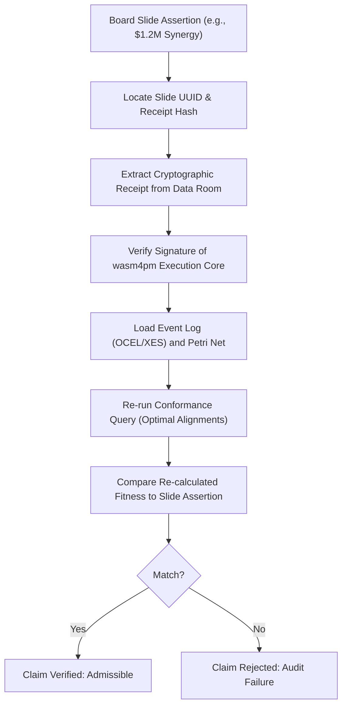

# Board-Admissible Claim Requirements

Process mining claims presented to executive boards during M&A transactions must be backed by reproducible execution evidence. This document establishes the strict validation rules and mathematical constraints required for any process intelligence assertion to be deemed board-admissible.

## 1. Core Admissibility Rules

No process assertion (e.g., "95% operational efficiency", "zero compliance drift", "no bottlenecks in logistics") is admissible unless it satisfies the following four pillars of process validation:

### A. Event Log Integrity and Provenance (Anti-Spoofing Protocol)
* **Standard Formats**: The underlying data must conform to public standards such as IEEE 1849-2016 (XES) or OCEL 2.0 (Object-Centric Event Logs) as defined in [OCEL Process Intelligence Placement](file:///Users/sac/process-intelligence/standards/ocel_process-intelligence_placement.md) and [XES Process Intelligence Placement](file:///Users/sac/process-intelligence/standards/xes_process-intelligence_placement.md).
* **Cryptographic Event-Chaining**: To prevent post-hoc log laundering or trace modification, every trace $\sigma = \langle e_1, e_2, \dots, e_n \rangle$ must form a hash chain. The cryptographic link $\mathcal{H}(e_j)$ is computed as:
  $$\mathcal{H}(e_j) = \operatorname{BLAKE3}(e_j \mathbin{\Vert} \mathcal{H}(e_{j-1}) \mathbin{\Vert} \operatorname{Sig}_{\text{system}}(e_j))$$
  with $\mathcal{H}(e_0) = \operatorname{BLAKE3}(\sigma_{\text{id}})$, where $\operatorname{Sig}_{\text{system}}(e_j)$ is the digital signature of the transactional system (ERP/CRM) generated at transaction commit time.
* **Extraction Traceability**: The log extraction process must be documented using a W3C PROV-O provenance model mapping each event back to its source transaction ID and its corresponding database Write-Ahead Log (WAL) sequence number.

### B. Mathematical Conformance Bounds
All claims must be accompanied by explicit fitness and precision metrics, calculated using optimal alignment-based conformance algorithms (Adriansyah 2014):
* **Fitness ($f$)**: Measures how much of the observed log behavior can be replayed by the process model. The board-admissibility threshold is $f \ge 0.95$. The fitness calculation must use optimal alignments to resolve deviations:
  $$f(L, N) = 1 - \frac{\sum_{\sigma \in L} L(\sigma) \cdot \operatorname{cost}(\gamma_{\text{opt}}(\sigma, N))}{\sum_{\sigma \in L} L(\sigma) \cdot \operatorname{cost}(\gamma_{\text{worst}}(\sigma, N))}$$
  where $L(\sigma)$ is the frequency of trace $\sigma$ in event log $L$, $\gamma_{\text{opt}}(\sigma, N)$ is the optimal alignment of trace $\sigma$ against model $N$, and $\gamma_{\text{worst}}(\sigma, N)$ is the worst-case alignment (aligning $\sigma$ entirely with moves-on-log and model steps to reach the sink place from the source place).
* **Precision ($p$)**: Measures how much behavior the process model allows that is not observed in the event log. The board-admissibility threshold is $p \ge 0.90$. It is calculated using alignment-driven state space analysis:
  $$p(L, N) = 1 - \frac{\sum_{M \in \mathcal{S}} | \operatorname{Enabled}(M) \setminus \operatorname{Observed}(M) |}{\sum_{M \in \mathcal{S}} | \operatorname{Enabled}(M) |}$$
  where $\mathcal{S}$ is the set of reachable markings visited during alignment replay, $\operatorname{Enabled}(M)$ is the set of transitions enabled in the model at marking $M$, and $\operatorname{Observed}(M)$ is the set of transitions observed in the log at marking $M$.
* **Generalization ($g$)**: Measures how well the model describes unseen behavior, with a threshold of $g \ge 0.85$.
* **Simplicity ($s$)**: Measured using structural properties of the Petri net or process tree, with a threshold of $s \ge 0.80$.

### C. Structural Model Soundness (van der Aalst 1998)
Any process model (Petri net or Workflow Net) representing the corporate state must be proven sound. Let $N = (P, T, F)$ be a Workflow Net (WF-net) with input place $i$, output place $o$, and initial marking $M_0 = [i]$. Let $[o]$ be the final marking (one token in sink place $o$ and zero elsewhere). Soundness requires:
* **Option to Complete**: From any reachable marking, it is always possible to reach the final marking:
  $$\forall M \in [M_0\rangle, \quad [o] \in [M\rangle$$
* **Liveness**: No transition in the WF-net is dead:
  $$\forall M \in [M_0\rangle, \forall t \in T, \exists M', M'' \in [P\rangle : M \xrightarrow{*} M' \xrightarrow{t} M''$$
* **Boundedness**: The net is bounded, ensuring no infinite token accumulation in any place:
  $$\exists k \in \mathbb{N}^+ : \forall M \in [M_0\rangle, \forall p \in P, \quad M(p) \le k$$

### D. Cryptographic Slide-to-Receipt Mapping
Every slide in the transaction deck containing a process capability assertion must map to a unique cryptographic receipt. This receipt is generated by the execution core (wasm4pm) after executing the validation query on the target event log.

## 2. Verification Protocol for Board Assertions

To verify a board claim, auditors and transaction partners must execute the following protocol:

## 3. Related M&A Validation Documents

* For details on how buyers rely on these claims, see [Buyer Reliance Requirements](file:///Users/sac/process-intelligence/ma/define_buyer_reliance_requirements.md).
* For details on how sellers defend these claims, see [Seller Defensibility Requirements](file:///Users/sac/process-intelligence/ma/define_seller_defensibility_requirements.md).
* For the mapping between slides and validation receipts, see [Slide-to-Receipt Map](file:///Users/sac/process-intelligence/ma/define_slide-to-receipt_map.md).
* For the taxonomy of board-level claims, see [Board Claim Taxonomy](file:///Users/sac/process-intelligence/ma/define_board_claim_taxonomy.md).