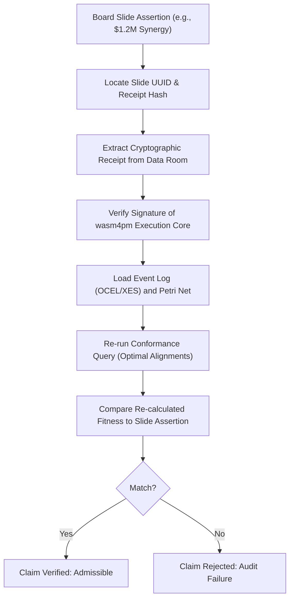

# Board-Admissible Claim Requirements

Process mining claims presented to executive boards during M&A transactions must be backed by reproducible execution evidence. This document establishes the strict validation rules and mathematical constraints required for any process intelligence assertion to be deemed board-admissible.

## 1. Core Admissibility Rules

No process assertion (e.g., "95% operational efficiency", "zero compliance drift", "no bottlenecks in logistics") is admissible unless it satisfies the following four pillars of process validation:

### A. Event Log Integrity and Provenance
* **Standard Formats**: The underlying data must conform to public standards such as IEEE 1849-2016 (XES) or OCEL 2.0 (Object-Centric Event Logs) as defined in [OCEL Process Intelligence Placement](file:///Users/sac/process-intelligence/standards/ocel_process-intelligence_placement.md) and [XES Process Intelligence Placement](file:///Users/sac/process-intelligence/standards/xes_process-intelligence_placement.md).
* **Cryptographic Hashing**: Every event and trace must be chained using a secure cryptographic hash function (SHA-256) to prevent tampering or post-hoc log laundering.
* **Extraction Traceability**: The log extraction process must be documented using a W3C PROV-O provenance model mapping each event back to its source ERP, CRM, or database transaction log.

### B. Mathematical Conformance Bounds
All claims must be accompanied by explicit fitness and precision metrics, calculated using alignment-based conformance algorithms (Adriansyah 2014):
* **Fitness ($f$)**: Measures how much of the observed log behavior can be replayed by the process model. The board-admissibility threshold is $f \ge 0.95$. The fitness calculation must use optimal alignments to resolve deviations:
  $$f(L, N) = 1 - \frac{\operatorname{cost}(\gamma_{opt})}{\operatorname{cost}(\gamma_{worst})}$$
* **Precision ($p$)**: Measures how much behavior the process model allows that is not observed in the event log. The board-admissibility threshold is $p \ge 0.90$.
* **Generalization ($g$)**: Measures how well the model describes unseen behavior, with a threshold of $g \ge 0.85$.
* **Simplicity ($s$)**: Measured using structural properties of the Petri net or process tree, with a threshold of $s \ge 0.80$.

### C. Structural Model Soundness (van der Aalst 1998)
Any process model (Petri net or Workflow Net) representing the corporate state must be proven sound:
* **Liveness**: No transition in the Workflow Net (WF-net) becomes dead; it is always possible to reactivate any process step.
* **Boundedness**: The number of tokens in any place remains bounded, indicating no infinite queue accumulation.
* **Option to Complete**: From any reachable marking, it is always possible to reach the final marking (sink place containing exactly one token, with no tokens elsewhere).

### D. Cryptographic Slide-to-Receipt Mapping
Every slide in the transaction deck containing a process capability assertion must map to a unique cryptographic receipt. This receipt is generated by the execution core (wasm4pm) after executing the validation query on the target event log.

## 2. Verification Protocol for Board Assertions

To verify a board claim, auditors and transaction partners must execute the following protocol:

## 3. Related M&A Validation Documents

* For details on how buyers rely on these claims, see [Buyer Reliance Requirements](file:///Users/sac/process-intelligence/ma/define_buyer_reliance_requirements.md).
* For details on how sellers defend these claims, see [Seller Defensibility Requirements](file:///Users/sac/process-intelligence/ma/define_seller_defensibility_requirements.md).
* For the mapping between slides and validation receipts, see [Slide-to-Receipt Map](file:///Users/sac/process-intelligence/ma/define_slide-to-receipt_map.md).
* For the taxonomy of board-level claims, see [Board Claim Taxonomy](file:///Users/sac/process-intelligence/ma/define_board_claim_taxonomy.md).