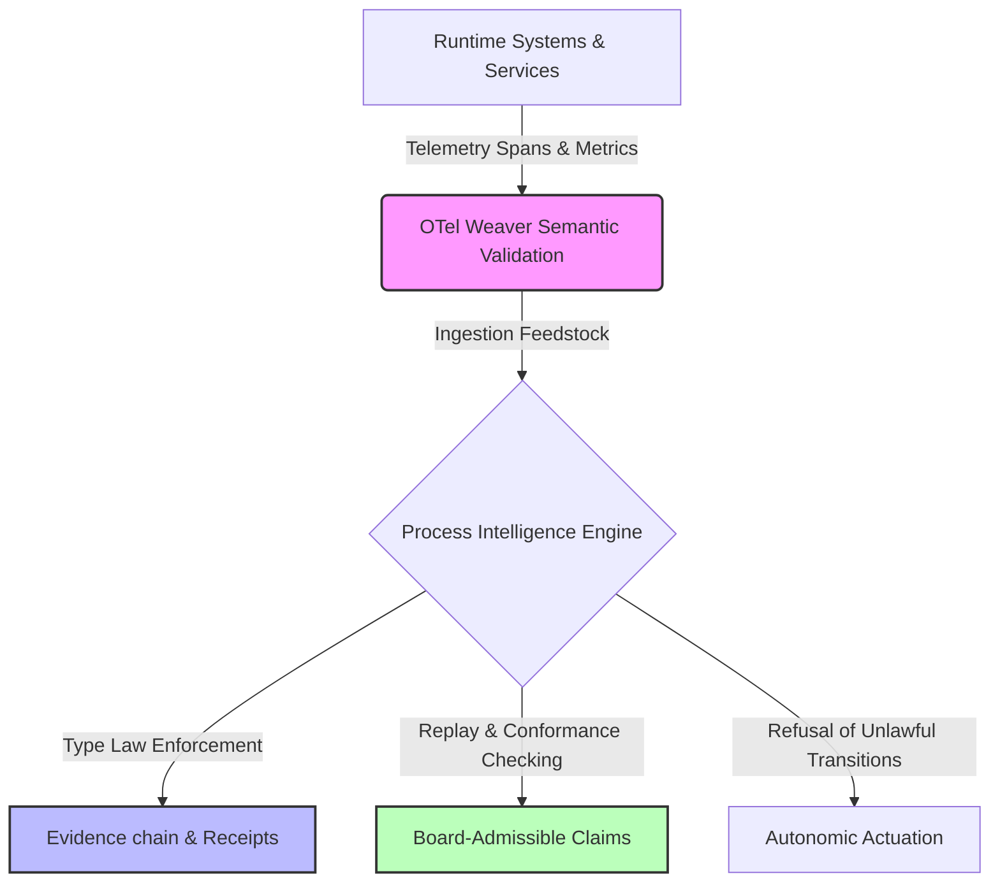

# OpenTelemetry Weaver Integration & Doctrines

**Authority:** `/Users/sac/process-intelligence/otel-weaver`  
**Status:** ACTIVE  
**Parent Framework:** Process Intelligence Research Foundry  

---

## Executive Summary

The OpenTelemetry (OTel) Weaver integration bridges the gap between raw, distributed software telemetry and high-assurance **Process Intelligence**. While OpenTelemetry standardizes the collection of distributed traces, spans, and metrics, and Weaver provides semantic conventions to validate their structure, these telemetry artifacts are fundamentally **feedstock**. They do not constitute process reality, process drift, or process evidence on their own.

This workspace establishes the formal doctrines governing the ingestion of OTel data and Weaver schema definitions, enforcing the separation of concerns between systems engineering (observability) and business-legal reality (conformance, accountability, and court-admissible evidence).

---

## Architectural Mapping

The Process Intelligence Research Foundry positions OTel Weaver at the entry layer of the ingestion pipeline. 

---

## Doctrine Registry

To prevent category collapse and maintain strict architectural boundaries, the following seven doctrines are formally defined and enforced. Click the links below to access the full-text specifications:

1. **[README.md](file:///Users/sac/process-intelligence/otel-weaver/README.md)**  
   *This file.* The entrypoint, index, and system-level architectural overview mapping OTel Weaver's role as a feedstock supplier.
   
2. **[otel-weaver-is-feedstock.md](file:///Users/sac/process-intelligence/otel-weaver/doctrine/otel-weaver-is-feedstock.md)**  
   Defines the role of schema validation. Schema correctness is not process compliance; OTel Weaver is feedstock, and telemetry must be processed through the type law of the Foundry to achieve receipt-backed reality.

3. **[telemetry-is-not-process-evidence.md](file:///Users/sac/process-intelligence/otel-weaver/doctrine/telemetry-is-not-process-evidence.md)**  
   Asserts the boundary: *telemetry is feedstock, process consequence is court*. Telemetry represents observers' reports of software operations, whereas process evidence requires immutable, receipt-bearing witness markers that can survive board audit.

4. **[weaver-finding-is-not-receipt.md](file:///Users/sac/process-intelligence/otel-weaver/doctrine/weaver-finding-is-not-receipt.md)**  
   Differentiates OTel Weaver semantic convention matching from transaction receipts. A Weaver finding proves structural compatibility; a Process Receipt proves execution validity and named law compliance.

5. **[registry-diff-is-not-process-drift.md](file:///Users/sac/process-intelligence/otel-weaver/doctrine/registry-diff-is-not-process-drift.md)**  
   Enforces that changes in semantic registries (Weaver diffs) do not represent drift in actual process execution. Weaver diffs are schema transitions; process drift is runtime divergence from normative models.

6. **[observability-by-design-vs-process-intelligence.md](file:///Users/sac/process-intelligence/otel-weaver/doctrine/observability-by-design-vs-process-intelligence.md)**  
   Contrasts the engineering-centric approach of building observable systems (logging, tracing) with the outcome-centric approach of process intelligence (formal semantics, lifecycle custody, conformance guarantees).

7. **[no-dashboard-truth.md](file:///Users/sac/process-intelligence/otel-weaver/doctrine/no-dashboard-truth.md)**  
   Dismantles the reliance on visual dashboard metrics as "ground truth". A dashboard is a projection without a receipt; ground truth is an auditable, replayable evidence chain.

---

## System Integration Standards

All software projects translating OpenTelemetry trace records to Object-Centric Event Logs (OCEL) or eXtensible Event Stream (XES) formats must comply with the following structural transformations:

- **Loss Accounting**: Any schema translation from OTel to OCEL must declare a `LossPolicy` and output a `LossReport` describing details like span duration truncation, resource scope collapse, and causality-to-correlation degradation.
- **Witness Markers**: Data pipelines must seal transformations with zero-sized witness types registering the translation logic (`OtelSpanToOcelEventProjection`).
- **Cryptographic Chaining**: Context propagation metrics (e.g., traceparent headers) must match runtime transaction records to prevent span injection or evidence spoofing.

---

*For technical integration, refer to the [OTel Weaver Standard Ledger Placement](file:///Users/sac/process-intelligence/standards/otel_weaver_projection_placement.md) and [OTel Weaver Source Standard Reference](file:///Users/sac/process-intelligence/standards/OTEL_WEAVER.md).*
