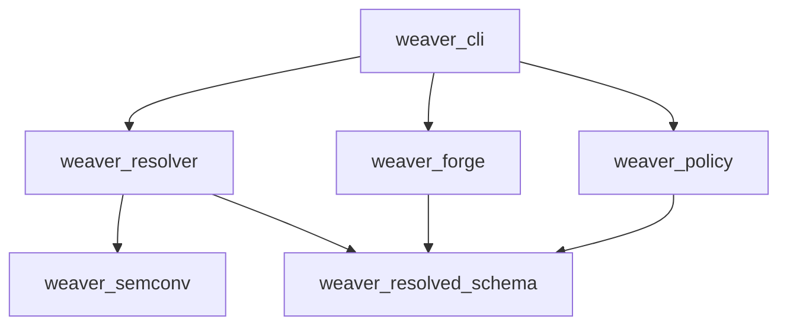

# OpenTelemetry Weaver Repository Document

This document provides a comprehensive overview of the [open-telemetry/weaver](https://github.com/open-telemetry/weaver) repository. Weaver is the official command-line utility and library suite developed under the OpenTelemetry project to model, parse, resolve, and generate source code and documentation from Semantic Convention registries.

---

## 1. Repository Purpose and Architectural Philosophy

Weaver is designed to address the challenges of managing telemetry contracts at scale. Telemetry (metrics, logs, traces) is the raw **feedstock** of any observability or process intelligence platform. In order for this feedstock to be admissible for downstream process consequence evaluation (which acts as the **court** of business logic compliance), it must strictly conform to predefined schemas.

Weaver enforces this boundary at the compiler/generator level. By treating semantic conventions as a versioned, testable contract, developers can generate type-safe telemetry SDK code, validate emitted structures, and identify schema changes (via diffing) in CI/CD.

> [!IMPORTANT]
> **Nominal Category Distinction**:
> - **Weaver Diffs are not Process Drift**: Running a `weaver registry diff` compares two versions of telemetry contracts (schemas). This is a purely structural schema-level check. It must never be confused with **process drift**, which refers to actual deviations in system execution paths, event order, or execution duration compared to a process model at runtime.

---

## 2. Codebase Directory and Crate Structure

Weaver is implemented in Rust as a Cargo workspace. The workspace is divided into several highly specialized crates, each responsible for a distinct phase of the telemetry schema pipeline:



### 2.1. Crate Directory Map

*   **`weaver_cli/`**:
    *   *Path*: `crates/weaver_cli`
    *   *Purpose*: The command-line entry point. It handles argument parsing via `clap`, console logging configuration, environment variable resolution, and invokes the underlying libraries. It exposes the `weaver registry`, `weaver diagnostic`, and `weaver completion` commands.
*   **`weaver_resolver/`**:
    *   *Path*: `crates/weaver_resolver`
    *   *Purpose*: The core compiler engine. It takes raw, flat semantic convention YAML files and resolves references (`ref`), imports, parent-child inheritance (`extends`), prefix cascading, and dependency trees into a single, cohesive resolved schema data structure.
*   **`weaver_semconv/`**:
    *   *Path*: `crates/weaver_semconv`
    *   *Purpose*: The YAML parser and validator for Weaver Semantic Convention registry syntax. It reads `manifest.yaml` and the target group YAML files and converts them into Rust structs representing raw definitions.
*   **`weaver_resolved_schema/`**:
    *   *Path*: `crates/weaver_resolved_schema`
    *   *Purpose*: Defines the data model of the resolved schema. This is the output format of `weaver_resolver` and the exact JSON data structure passed to the code generation engine (`weaver_forge`) and policy engine (`weaver_policy`).
*   **`weaver_forge/`**:
    *   *Path*: `crates/weaver_forge`
    *   *Purpose*: The code generation engine. It loads templates (written in Jinja2 format), processes them using `jaq` (a Rust implementation of JQ for data filtering), applies type mapping and acronym formats, and generates output files.
*   **`weaver_policy/`**:
    *   *Path*: `crates/weaver_policy`
    *   *Purpose*: The validation gatekeeper. It wraps the Open Policy Agent (OPA) Rego runtime to evaluate semantic convention structures against rules like naming prefixes, missing attributes, or deprecated stability flags.
*   **`weaver_common/`**:
    *   *Path*: `crates/weaver_common`
    *   *Purpose*: Internal shared utilities, error types, logging macros, and file path manipulation functions used across the workspace.

---

## 3. Cloning, Compiling, and Installing

### 3.1. Prerequisites
To compile Weaver, you require the Rust toolchain (v1.75.0 or later recommended).

### 3.2. Step-by-Step Build Commands

1.  **Clone the Repository**:
    ```bash
    git clone https://github.com/open-telemetry/weaver.git
    cd weaver
    ```

2.  **Run Workspace Tests**:
    Verify that all units and integration tests pass on your machine:
    ```bash
    cargo test --workspace
    ```

3.  **Compile in Release Mode**:
    Compile the optimized binary:
    ```bash
    cargo build --release
    ```
    The generated binary is placed at `target/release/weaver`.

4.  **Install Locally**:
    Install the binary directly into your cargo bin path (`~/.cargo/bin/weaver`):
    ```bash
    cargo install --path crates/weaver_cli
    ```

---

## 4. Contributing to Weaver

Contributors must adhere to standard Rust coding practices:
*   Run `cargo fmt --all -- --check` to enforce codebase styling standards.
*   Run `cargo clippy --workspace --all-targets -- -D warnings` to enforce lint hygiene.
*   Ensure all new features include unit tests in their respective crates, and update integrations tests under `tests/` in `weaver_cli`.
