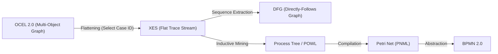

# Public Ontology Reverse Lock-In Map

Vendor lock-in represents a major financial risk when proprietary process mining suites (e.g., Celonis, Signavio, UiPath) are used. To maintain buyer independence and guarantee long-term auditability, the foundry enforces a **Reverse Lock-In Map** that defines translation paths from proprietary databases and schemas into open, standard formats.

For the core rules of standard compliance, see [Public Standards Gravity](file:///Users/sac/process-intelligence/doctrine/public-standards-gravity.md).

---

## 1. Translation Maps from Proprietary Formats

The foundry's ingestion core (`wasm4pm`) includes adapters to convert proprietary log tables and models into open standards:

| Proprietary Source System | Extracted Artifact | Target Open Standard | Ingestion Protocol |
| :--- | :--- | :--- | :--- |
| **SAP Celonis IBC** | Event/Activity Tables | **OCEL 2.0** | Map relational tables to object and event JSON structures. |
| **Signavio XML** | Process Diagrams | **BPMN 2.0** | Convert Signavio-specific XML namespaces to standard elements. |
| **UiPath Process Mining** | Event Logs | **XES** | Translate flat logs and attribute arrays to standard XES formats. |
| **SAP Signavio PI** | Process Graphs | **Petri Net (PNML)** | Convert process flow graphs into bipartite PNML structures. |

---

## 2. Standard-to-Standard Translations

To enable cross-tool interoperability and diverse analytical views, the ledger supports standard-to-standard transformations:

---

## 3. Translation Verification and Integrity

To verify that a translation from a proprietary format has not introduced errors or discarded data:
1.  **Delta Analysis**: The converter outputs a delta report detailing any event or attribute that could not be mapped.
2.  **Equivalence Replay**: The source log and target log are replayed on a baseline model; fitness scores must match within the $10^{-6}$ tolerance:
    $$\left| f_{\text{source}} - f_{\text{target}} \right| \le 10^{-6}$$
3.  For a sample translation and reverse-lock-in validation, see the [Reverse Lock-in Sample](file:///Users/sac/process-intelligence/experiments/reverse_lock-in_sample.md).