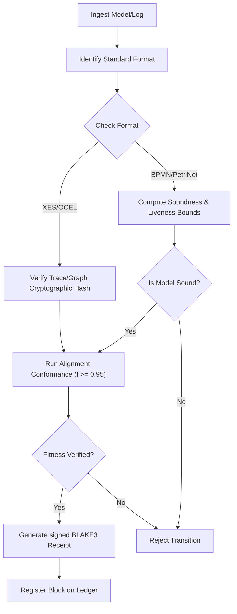

# Public Standards to Blue River Dam Mapping

The **Blue River Dam Doctrine** serves as the central gatekeeper for process validation in the foundry. This document defines the formal rules for validating and checking each supported public standard before it is registered in the corporate ledger.

For the core rules of compliance and the rule of admissibility, see the [Blue River Dam Doctrine](file:///Users/sac/process-intelligence/doctrine/blue-river-dam.md).

---

## 1. Conformance and Soundness Checks by Standard

The following matrix defines the mandatory validation rules that the `wasm4pm` execution core runs for each standard:

| Standard | Target Structure | Mandated Verification Rule | Primary Academic Foundation |
| :--- | :--- | :--- | :--- |
| **XES** | Event Log | Trace-based optimal alignments and token-based replay fitness. | [Adriansyah 2014](file:///Users/sac/process-intelligence/sources/papers/paper-canon.md) |
| **OCEL** | Object Graph | Multi-object graph integrity and multi-object alignments. | [Ghahfarokhi 2021](file:///Users/sac/process-intelligence/sources/papers/paper-canon.md) |
| **BPMN** | Process Model | Compilation to Petri Net followed by structural soundness verification. | [Weske 2019](file:///Users/sac/process-intelligence/sources/papers/paper-canon.md) |
| **Petri Net**| Process Model | Soundness (liveness, boundedness, option to complete). | [van der Aalst 1998](file:///Users/sac/process-intelligence/sources/papers/paper-canon.md) |
| **WF-Net** | Process Model | Start/sink connectivity and short-circuited liveness. | [van der Aalst 1998](file:///Users/sac/process-intelligence/sources/papers/paper-canon.md) |
| **POWL** | Process Tree | Parent-child acyclicity and DAG source-sink correctness. | [Leemans 2013](file:///Users/sac/process-intelligence/sources/papers/paper-canon.md) |
| **Declare** | LTL Constraints| Finite State Automata (FSA) trace acceptance. | [Paper Canon](file:///Users/sac/process-intelligence/sources/papers/paper-canon.md) |
| **DFG** | Transition Graph| Flow conservation and edge adjacency verification. | [Public Standards Gravity](file:///Users/sac/process-intelligence/doctrine/public-standards-gravity.md) |

---

## 2. Validation Gate Execution Protocol

When a process state transition is registered, the validation gate executes the following mathematical check:

---

## 3. Dynamic Threshold Enforcements

*   **Fitness Gate ($f$)**: The aggregate replay fitness of any ingested log against its corresponding model must satisfy $f \ge 0.95$. Under no circumstances shall a transaction run be admitted if fitness falls below $0.85$, even with a Board override, as defined in [Blue River Dam Doctrine](file:///Users/sac/process-intelligence/doctrine/blue-river-dam.md).
*   **Precision Gate ($p$)**: The process model's precision must satisfy $p \ge 0.90$ to prevent under-specified models from hiding deviations.
*   **Boundedness Gate**: The execution core automatically freezes and aborts any transaction that violates 1-boundedness of control places.