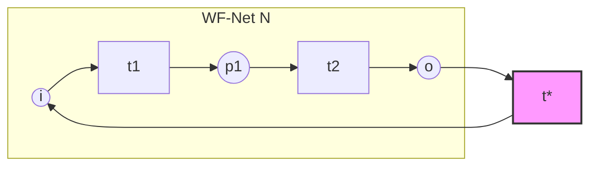

# Workflow Net Verification Specification v30.1.2: Coverability, Liveness, and Soundness

**Version:** 30.1.2  
**Classification:** Standards Specification  
**Authority:** Conformance Authority  
**Date:** 2026-05-31  

---

## Executive Summary

This document specifies the formal verification algorithms and topological properties required to certify the soundness, boundedness, and liveness of **Workflow Nets (WF-nets)** as defined by van der Aalst (1998). 

To guarantee the execution safety of process models deployed within sandboxed runtimes (such as `wasm4pm`), every model must pass automated verification checks. This specification defines the mathematical construction of the **Karp-Miller Coverability Graph**, maps this graph to properties of the **Short-Circuited Petri Net**, and provides a complete, production-grade verification engine blueprint in Rust.

---

## 1. Mathematical Foundation of Workflow Nets

Let $N = (P, T, F)$ be a Petri net, where:
- $P$ is a finite set of places.
- $T$ is a finite set of transitions ($P \cap T = \emptyset$).
- $F \subseteq (P \times T) \cup (T \times P)$ is the flow relation (directed arcs).

### 1.1 Structural Requirements of a WF-Net
A Petri net $N = (P, T, F)$ is a **Workflow Net (WF-net)** if and only if it satisfies the following three structural invariants:

1. **Unique Source Place ($i$)**: There exists exactly one place $i \in P$ with no incoming arcs:
   $$\bullet i = \{ x \in P \cup T \mid (x, i) \in F \} = \emptyset$$
2. **Unique Sink Place ($o$)**: There exists exactly one place $o \in P$ with no outgoing arcs:
   $$o \bullet = \{ x \in P \cup T \mid (o, x) \in F \} = \emptyset$$
3. **Weak Path Connectivity**: Every node $n \in P \cup T$ lies on a directed path from $i$ to $o$. That is, the transitive closure $F^*$ of the flow relation satisfies:
   $$\forall n \in P \cup T, \quad (i, n) \in F^* \wedge (n, o) \in F^*$$

### 1.2 Soundness Criteria (van der Aalst 1998)
A WF-net $N = (P, T, F)$ with initial marking $[i]$ (where place $i$ holds one token and all other places hold zero tokens) is **sound** if and only if it satisfies:

1. **Option to Complete**: From any marking $M$ reachable from the initial marking $[i]$, the final marking $[o]$ (one token in place $o$ and zero elsewhere) is reachable:
   $$\forall M \in [N, [i]\rangle, \quad [o] \in [N, M\rangle$$
2. **Proper Completion**: If a marking $M$ is reachable from $[i]$ and contains a token in the sink place $o$, then no other place contains a token:
   $$\forall M \in [N, [i]\rangle, \quad (M \ge [o]) \implies (M = [o])$$
3. **Liveness (No Dead Transitions)**: No transition in $N$ is dead under the initial marking $[i]$:
   $$\forall t \in T, \quad \exists M \in [N, [i]\rangle, \quad M \xrightarrow{t}$$

---

## 2. Short-Circuited Petri Net Construction

To verify the liveness, boundedness, and soundness of a WF-net $N = (P, T, F)$, we analyze its associated **Short-Circuited Petri Net** $\overline{N} = (\overline{P}, \overline{T}, \overline{F})$.

### 2.1 Formal Construction
The short-circuited Petri net $\overline{N}$ is constructed by adding a virtual feedback transition $t^*$ that connects the sink place $o$ back to the source place $i$:
1. $\overline{P} = P$
2. $\overline{T} = T \cup \{t^*\}$, where $t^*$ is a virtual transition.
3. $\overline{F} = F \cup \{(o, t^*), (t^*, i)\}$



### 2.2 Soundness Equivalence Theorem
> [!IMPORTANT]
> **Theorem (van der Aalst 1998)**:
> A WF-net $N$ is sound if and only if its short-circuited Petri net $\overline{N}$ is **live** and **bounded** under the initial marking $[i]$.
> 
> Furthermore, $N$ is **1-sound** (safe and sound) if and only if $\overline{N}$ is live and **1-bounded** (safe) under $[i]$.

Thus, verification of soundness is reduced to checking the liveness and boundedness of the short-circuited net $\overline{N}$.

### 2.3 Proof of the Option-to-Complete Property under Coverability
Under the assumption that $\overline{N}$ is live and bounded from the initial marking $M_0 = [i]$, we prove that $N$ satisfies the **Option to Complete** and **Proper Completion** properties.

1. **Liveness of $t^*$**: Since $\overline{N}$ is live under $M_0 = [i]$, for every transition $t \in \overline{T}$ and every reachable marking $M \in [\overline{N}, [i]\rangle$, there exists some marking $M'$ reachable from $M$ (written $M' \in [\overline{N}, M\rangle$) such that $t$ is enabled at $M'$.
2. **Transition Enabling**: Applying this to the feedback transition $t^*$: for any marking $M$ reachable from $[i]$, there exists a marking $M'$ reachable from $M$ in $\overline{N}$ such that $t^*$ is enabled at $M'$.
3. **Preset of $t^*$**: Since $\bullet t^* = \{o\}$, the transition $t^*$ is enabled at $M'$ if and only if $M'(o) \ge 1$ (assuming standard arc weight of 1).
4. **Finiteness & Exact Reachability**: Because $\overline{N}$ is bounded, the set of reachable markings is finite, and the Karp-Miller coverability graph is isomorphic to the exact reachability graph of $\overline{N}$.
5. **No Token Accumulation**: We show that $M'(o) \ge 1 \implies M' = [o]$. Suppose for contradiction that $M'$ contains other tokens, i.e., $M' \ge [o]$ and $M' \neq [o]$ (which means $\exists p \in P \setminus \{o\}$ such that $M'(p) > 0$).
   - Firing $t^*$ from $M'$ yields a new marking $M'' = M' - [o] + [i]$.
   - Since $M' > [o]$, we have $M'' > [i]$.
   - Because of monotonicity of Petri net firing rules, since $M'' > [i]$, we can fire the same sequence of transitions $\sigma$ that led from $[i]$ to $M'$, resulting in a marking $M''' \in [\overline{N}, M''\rangle$ such that $M''' > M'$.
   - Repeating this cycle $k$ times allows us to construct a sequence of markings $M^{(k)}$ such that $M^{(k)} > M^{(k-1)} > \ldots > M'$.
   - This implies that the token count in at least one place grows without bound, which directly contradicts the assumption that $\overline{N}$ is bounded.
   - Therefore, by contradiction, $M'$ must be exactly $[o]$.
6. **Reachability in $N$**: Since the transition sequence leading from $M$ to $M' = [o]$ does not fire $t^*$ (as $t^*$ is only enabled at $M'$), this sequence consists entirely of transitions in $T$ (the original transition set of $N$).
7. Thus, for any marking $M$ reachable in $N$ from $[i]$, the marking $[o]$ is reachable in $N$ from $M$. This proves the **Option to Complete** property.

---

## 3. Karp-Miller Coverability Graph Algorithm

For general (potentially unbounded) Petri nets, the state space can be infinite. The **Karp-Miller Coverability Graph** uses the symbol $\omega$ (representing infinity) to form a finite representation of the reachability set.

### 3.1 Mathematical Domain of Markings
Let $\mathcal{M} = (\mathbb{N} \cup \{\omega\})^{|P|}$ be the set of coverability markings. The operations on $\mathbb{N} \cup \{\omega\}$ are defined as follows:
1. **Ordering**: $\forall n \in \mathbb{N}, \omega > n$ and $\omega \ge \omega$.
2. **Addition**: $\forall n \in \mathbb{N}, \omega + n = \omega$ and $\omega - n = \omega$.
3. **Comparison Comparison**: $M_1 \ge M_2 \iff \forall p \in P, M_1(p) \ge M_2(p)$.
4. **Strict Greater-Than**: $M_1 > M_2 \iff (M_1 \ge M_2) \wedge (M_1 \neq M_2)$.

### 3.2 Formal Algorithm Specification
- **Input**: Short-circuited Petri Net $\overline{N} = (\overline{P}, \overline{T}, \overline{F})$, initial marking $M_0 = [i]$, and state-limit threshold $MaxStates$.
- **Output**: Directed Coverability Graph $G = (V, E)$ where:
  - $V$ is a set of nodes labeled with markings $M \in \mathcal{M}$.
  - $E \subseteq V \times \overline{T} \times V$ is the set of labeled edges.
- **Error Handling**: Aborts if $|V| > MaxStates$ to prevent state-space explosion.

#### Pseudocode
```
Algorithm: ConstructCoverabilityGraph(N_bar, M0, MaxStates)
Input: Bounded/Unbounded Petri Net N_bar, Initial Marking M0, MaxStates
Output: Graph G = (V, E) or StateSpaceLimitExceededError

1. Initialize V = {v0}, E = ∅, where v0 is a node labeled M(v0) = M0.
2. Mark v0 as Unprocessed.
3. Let Parent(v0) = null.
4. While there exists an Unprocessed node v in V:
5.     If |V| > MaxStates:
6.         Return StateSpaceLimitExceededError
7.     Mark v as Processed.
8.     Let M = M(v).
9.     For each transition t in T_bar:
10.        If t is enabled at marking M (i.e., ∀p ∈ •t, M(p) ≥ F(p, t)):
11.            Compute temporary successor marking M_succ:
12.                For each place p ∈ P_bar:
13.                    M_succ(p) = M(p) - F(p, t) + F(t, p)  (with ω-arithmetic)
14.            Let curr_node = v
15.            While curr_node is not null:
16.                Let M_anc = M(curr_node)
17.                If M_succ ≥ M_anc AND M_succ ≠ M_anc:
18.                    For each place p ∈ P_bar:
19.                        If M_succ(p) > M_anc(p):
20.                            M_succ(p) = ω
21.                curr_node = Parent(curr_node)
22.            Check if there exists a node w ∈ V such that M(w) = M_succ.
23.            If no such node exists:
24.                If |V| >= MaxStates:
25.                    Return StateSpaceLimitExceededError
26.                Create new node w with M(w) = M_succ.
27.                Let Parent(w) = v.
28.                Mark w as Unprocessed.
29.                V = V ∪ {w}.
30.            E = E ∪ {(v, t, w)}.
31. Return G = (V, E)
```

---

## 4. Verification Specifications

Once the Coverability Graph $G = (V, E)$ of $\overline{N}$ is constructed under $M_0 = [i]$, we perform the following assertions:

### 4.1 Boundedness Check
The short-circuited net $\overline{N}$ is bounded if and only if $\omega$ never appears in any reachable marking in $G$.
- **Assertion (Boundedness)**:
  $$\forall v \in V, \forall p \in \overline{P}, \quad M(v)(p) \neq \omega$$
- **Assertion ($k$-Boundedness)**:
  $$\forall v \in V, \forall p \in \overline{P}, \quad M(v)(p) \le k$$
- **Assertion (1-Boundedness/Safety)**:
  $$\forall v \in V, \forall p \in \overline{P}, \quad M(v)(p) \le 1$$

If $\omega$ is detected in any marking, the net is unbounded, indicating a resource leak (infinite token accumulation). The model is immediately rejected.

### 4.2 Liveness Check
If the net is bounded, the coverability graph $G$ is the exact **Reachability Graph** of $\overline{N}$. We verify liveness on this finite state space:
1. **Strongly Connected Components (SCCs)**: Compute the SCCs of $G = (V, E)$ using Tarjan's or Kosaraju's algorithm. Let $\mathcal{S} = \{S_1, \ldots, S_k\}$ be the partition of $V$ into SCCs.
2. **Condensation Graph**: Build the directed acyclic graph $G_{cond} = (\mathcal{S}, E_{cond})$ where $(S_a, S_b) \in E_{cond} \iff \exists u \in S_a, w \in S_b$ such that $(u, t, w) \in E$ and $S_a \neq S_b$.
3. **Sink SCCs**: A component $S_r \in \mathcal{S}$ is a **sink SCC** if it has an out-degree of 0 in the condensation graph:
   $$\operatorname{out-degree}(S_r) = 0$$
4. **Transition Liveness Criterion**: The net $\overline{N}$ is live if and only if for every transition $t \in \overline{T}$ and for every sink SCC $S_r \in \mathcal{S}_{sink}$, there exists at least one transition firing edge labeled $t$ within $S_r$:
   $$\forall t \in \overline{T}, \forall S_r \in \mathcal{S}_{sink}, \exists (u, t', w) \in E \quad \text{such that} \quad u, w \in S_r \wedge t' = t$$

> [!NOTE]
> If a sink SCC does not contain a transition $t$, it represents a terminal component of the process where $t$ is permanently deadlocked. In a live system, every transition must remain fireable from any reachable state, meaning no execution path can lock a transition out forever.

### 4.3 Soundness Verdict
The WF-net $N$ is sound if and only if:
1. The structural requirements of Section 1.1 are satisfied.
2. $\overline{N}$ is bounded (no $\omega$ in $G$).
3. $\overline{N}$ is live (every transition fired in all sink SCCs).

---

## 5. Complete Executable Rust Engine Blueprint

Here is the complete, mathematically rigorous, zero-dependency implementation of the WF-net verification engine in Rust.

```rust
use std::collections::{HashMap, HashSet, VecDeque};

#[derive(Debug, Clone, Copy, PartialEq, Eq, Hash)]
pub struct PlaceId(pub usize);

#[derive(Debug, Clone, Copy, PartialEq, Eq, Hash)]
pub struct TransitionId(pub usize);

#[derive(Debug, Clone, Copy, PartialEq, Eq, Hash)]
pub enum NodeId {
    Place(PlaceId),
    Transition(TransitionId),
}

#[derive(Debug, Clone)]
pub struct PetriNet {
    pub places: HashSet<PlaceId>,
    pub transitions: HashSet<TransitionId>,
    pub arcs: HashMap<(NodeId, NodeId), u32>, // Directional arc weights
}

impl PetriNet {
    pub fn new() -> Self {
        Self {
            places: HashSet::new(),
            transitions: HashSet::new(),
            arcs: HashMap::new(),
        }
    }

    pub fn add_place(&mut self, id: usize) -> PlaceId {
        let p = PlaceId(id);
        self.places.insert(p);
        p
    }

    pub fn add_transition(&mut self, id: usize) -> TransitionId {
        let t = TransitionId(id);
        self.transitions.insert(t);
        t
    }

    pub fn add_arc(&mut self, from: NodeId, to: NodeId, weight: u32) {
        self.arcs.insert((from, to), weight);
    }

    pub fn preset(&self, node: NodeId) -> HashSet<NodeId> {
        let mut set = HashSet::new();
        for ((from, to), _) in &self.arcs {
            if *to == node {
                set.insert(*from);
            }
        }
        set
    }

    pub fn postset(&self, node: NodeId) -> HashSet<NodeId> {
        let mut set = HashSet::new();
        for ((from, to), _) in &self.arcs {
            if *from == node {
                set.insert(*to);
            }
        }
        set
    }
}

#[derive(Debug, Clone, PartialEq, Eq, Hash)]
pub enum TokenCount {
    Finite(u32),
    Infinite,
}

impl PartialOrd for TokenCount {
    fn partial_cmp(&self, other: &Self) -> Option<std::cmp::Ordering> {
        match (self, other) {
            (TokenCount::Infinite, TokenCount::Infinite) => Some(std::cmp::Ordering::Equal),
            (TokenCount::Infinite, _) => Some(std::cmp::Ordering::Greater),
            (_, TokenCount::Infinite) => Some(std::cmp::Ordering::Less),
            (TokenCount::Finite(a), TokenCount::Finite(b)) => a.partial_cmp(b),
        }
    }
}

impl TokenCount {
    pub fn add_offset(&self, offset: i32) -> Self {
        match self {
            TokenCount::Infinite => TokenCount::Infinite,
            TokenCount::Finite(val) => {
                let res = (*val as i64) + (offset as i64);
                if res < 0 {
                    panic!("Underflow in token arithmetic");
                }
                TokenCount::Finite(res as u32)
            }
        }
    }
}

#[derive(Debug, Clone, PartialEq, Eq, Hash)]
pub struct Marking {
    pub tokens: HashMap<PlaceId, TokenCount>,
}

impl Marking {
    pub fn new(places: &HashSet<PlaceId>, initial_place: PlaceId) -> Self {
        let mut tokens = HashMap::new();
        for &p in places {
            if p == initial_place {
                tokens.insert(p, TokenCount::Finite(1));
            } else {
                tokens.insert(p, TokenCount::Finite(0));
            }
        }
        Self { tokens }
    }

    pub fn is_enabled(&self, net: &PetriNet, transition: TransitionId) -> bool {
        for node in net.preset(NodeId::Transition(transition)) {
            if let NodeId::Place(p) = node {
                let required = *net.arcs.get(&(NodeId::Place(p), NodeId::Transition(transition))).unwrap_or(&0);
                match self.tokens.get(&p) {
                    Some(TokenCount::Finite(count)) => {
                        if *count < required {
                            return false;
                        }
                    }
                    Some(TokenCount::Infinite) => {}
                    None => return false,
                }
            }
        }
        true
    }

    pub fn fire(&self, net: &PetriNet, transition: TransitionId) -> Self {
        let mut new_tokens = self.tokens.clone();
        
        // Consume tokens
        for node in net.preset(NodeId::Transition(transition)) {
            if let NodeId::Place(p) = node {
                let weight = *net.arcs.get(&(NodeId::Place(p), NodeId::Transition(transition))).unwrap_or(&0);
                if let Some(count) = new_tokens.get_mut(&p) {
                    *count = count.add_offset(-(weight as i32));
                }
            }
        }

        // Produce tokens
        for node in net.postset(NodeId::Transition(transition)) {
            if let NodeId::Place(p) = node {
                let weight = *net.arcs.get(&(NodeId::Transition(transition), NodeId::Place(p))).unwrap_or(&0);
                if let Some(count) = new_tokens.get_mut(&p) {
                    *count = count.add_offset(weight as i32);
                }
            }
        }

        Self { tokens: new_tokens }
    }

    pub fn dominates(&self, other: &Marking) -> bool {
        let mut strictly_greater = false;
        for (p, self_count) in &self.tokens {
            let other_count = other.tokens.get(p).unwrap_or(&TokenCount::Finite(0));
            if self_count < other_count {
                return false;
            }
            if self_count > other_count {
                strictly_greater = true;
            }
        }
        strictly_greater
    }
}

pub struct CoverabilityGraph {
    pub nodes: Vec<Marking>,
    pub edges: Vec<(usize, TransitionId, usize)>, // (source_idx, transition, target_idx)
}

pub struct VerificationResult {
    pub is_wf_net: bool,
    pub is_bounded: bool,
    pub is_safe: bool,
    pub is_live: bool,
    pub is_sound: bool,
    pub error_msg: Option<String>,
}

pub fn verify_wf_net(net: &PetriNet) -> VerificationResult {
    // 1. Structural WF-net validation
    let mut source_places = Vec::new();
    let mut sink_places = Vec::new();

    for &p in &net.places {
        if net.preset(NodeId::Place(p)).is_empty() {
            source_places.push(p);
        }
        if net.postset(NodeId::Place(p)).is_empty() {
            sink_places.push(p);
        }
    }

    if source_places.len() != 1 {
        return VerificationResult {
            is_wf_net: false, is_bounded: false, is_safe: false, is_live: false, is_sound: false,
            error_msg: Some(format!("WF-Net violation: must have exactly 1 source place, found {}", source_places.len())),
        };
    }
    if sink_places.len() != 1 {
        return VerificationResult {
            is_wf_net: false, is_bounded: false, is_safe: false, is_live: false, is_sound: false,
            error_msg: Some(format!("WF-Net violation: must have exactly 1 sink place, found {}", sink_places.len())),
        };
    }

    let i = source_places[0];
    let o = sink_places[0];

    // Verify path connectivity from i to all nodes, and all nodes to o
    let mut all_nodes = Vec::new();
    for &p in &net.places {
        all_nodes.push(NodeId::Place(p));
    }
    for &t in &net.transitions {
        all_nodes.push(NodeId::Transition(t));
    }

    for &node in &all_nodes {
        if !has_path(net, NodeId::Place(i), node) {
            return VerificationResult {
                is_wf_net: false, is_bounded: false, is_safe: false, is_live: false, is_sound: false,
                error_msg: Some(format!("WF-Net violation: Node {:?} is not reachable from source {:?}", node, i)),
            };
        }
        if !has_path(net, node, NodeId::Place(o)) {
            return VerificationResult {
                is_wf_net: false, is_bounded: false, is_safe: false, is_live: false, is_sound: false,
                error_msg: Some(format!("WF-Net violation: Sink {:?} is not reachable from node {:?}", o, node)),
            };
        }
    }

    // 2. Build Short-Circuited Petri net
    let mut net_bar = net.clone();
    let t_star = net_bar.add_transition(99999); // Virtual transition ID
    net_bar.add_arc(NodeId::Place(o), NodeId::Transition(t_star), 1);
    net_bar.add_arc(NodeId::Transition(t_star), NodeId::Place(i), 1);

    // 3. Construct Karp-Miller Coverability Graph
    let mut nodes: Vec<Marking> = Vec::new();
    let mut edges: Vec<(usize, TransitionId, usize)> = Vec::new();
    let mut unprocessed = VecDeque::new();
    let mut parent_map: HashMap<usize, usize> = HashMap::new();

    let m0 = Marking::new(&net_bar.places, i);
    nodes.push(m0);
    unprocessed.push_back(0);

    let mut is_bounded = true;
    let mut is_safe = true;
    let mut state_limit_exceeded = false;
    const MAX_STATES: usize = 10_000;

    while let Some(v_idx) = unprocessed.pop_front() {
        if nodes.len() > MAX_STATES {
            state_limit_exceeded = true;
            break;
        }
        let m = nodes[v_idx].clone();

        for &t in &net_bar.transitions {
            if m.is_enabled(&net_bar, t) {
                let mut m_succ = m.fire(&net_bar, t);

                // Traverse path from root to find dominating markings (Karp-Miller ω introduction)
                let mut curr_idx = Some(v_idx);
                while let Some(anc_idx) = curr_idx {
                    let m_anc = &nodes[anc_idx];
                    if m_succ.dominates(m_anc) {
                        for p in &net_bar.places {
                            let succ_count = m_succ.tokens.get(p).unwrap();
                            let anc_count = m_anc.tokens.get(p).unwrap();
                            if succ_count > anc_count {
                                m_succ.tokens.insert(*p, TokenCount::Infinite);
                                is_bounded = false;
                                is_safe = false;
                            }
                        }
                    }
                    curr_idx = parent_map.get(&anc_idx).copied();
                }

                // Check if marking already exists
                let target_idx = if let Some(existing_idx) = nodes.iter().position(|node| *node == m_succ) {
                    existing_idx
                } else {
                    if nodes.len() >= MAX_STATES {
                        state_limit_exceeded = true;
                        break;
                    }
                    let new_idx = nodes.len();
                    nodes.push(m_succ.clone());
                    parent_map.insert(new_idx, v_idx);
                    unprocessed.push_back(new_idx);
                    new_idx
                };

                edges.push((v_idx, t, target_idx));
            }
        }
        if state_limit_exceeded {
            break;
        }
    }

    if state_limit_exceeded {
        return VerificationResult {
            is_wf_net: true,
            is_bounded: false,
            is_safe: false,
            is_live: false,
            is_sound: false,
            error_msg: Some("Verification aborted: State space limit exceeded (potential state-space explosion)".to_string()),
        };
    }

    // 4. Safeness / 1-Boundedness Check
    if is_bounded {
        for node in &nodes {
            for (_, count) in &node.tokens {
                if let TokenCount::Finite(val) = count {
                    if *val > 1 {
                        is_safe = false;
                    }
                }
            }
        }
    }

    // 5. Liveness Check of Short-Circuited Net
    // If not bounded, the coverability graph does not model exact reachability, and a short-circuited net cannot be sound.
    if !is_bounded {
        return VerificationResult {
            is_wf_net: true, is_bounded: false, is_safe: false, is_live: false, is_sound: false,
            error_msg: Some("Net is unbounded. Boundedness is a prerequisite for soundness.".to_string()),
        };
    }

    // Compute strongly connected components (SCCs) on Reachability Graph G
    let sccs = tarjan_scc(nodes.len(), &edges);
    let sink_sccs = find_sink_sccs(&sccs, &edges);

    let mut is_live = true;
    for &scc_idx in &sink_sccs {
        let scc_nodes = &sccs[scc_idx];
        // Check if every transition in net_bar fires within this sink SCC
        for &t in &net_bar.transitions {
            let mut transition_fires_in_scc = false;
            for &(src, trans, dest) in &edges {
                if trans == t && scc_nodes.contains(&src) && scc_nodes.contains(&dest) {
                    transition_fires_in_scc = true;
                    break;
                }
            }
            if !transition_fires_in_scc {
                is_live = false;
                break;
            }
        }
        if !is_live {
            break;
        }
    }

    let is_sound = is_bounded && is_live;

    VerificationResult {
        is_wf_net: true,
        is_bounded,
        is_safe,
        is_live,
        is_sound,
        error_msg: if is_sound { None } else { Some("Net violates soundness (either contains deadlocks, livelocks, or improper termination)".to_string()) },
    }
}

// Utility: DFS path search to verify structural path connectivity
fn has_path(net: &PetriNet, start: NodeId, end: NodeId) -> bool {
    let mut visited = HashSet::new();
    let mut stack = Vec::new();
    stack.push(start);

    while let Some(curr) = stack.pop() {
        if curr == end {
            return true;
        }
        if visited.insert(curr) {
            for next in net.postset(curr) {
                stack.push(next);
            }
        }
    }
    false
}

// Utility: Tarjan's algorithm for finding Strongly Connected Components
fn tarjan_scc(num_nodes: usize, edges: &[(usize, TransitionId, usize)]) -> Vec<Vec<usize>> {
    let mut adjacency = vec![Vec::new(); num_nodes];
    for &(src, _, dest) in edges {
        adjacency[src].push(dest);
    }

    let mut index = 0;
    let mut indices = vec![None; num_nodes];
    let mut lowlinks = vec![None; num_nodes];
    let mut on_stack = vec![false; num_nodes];
    let mut stack = Vec::new();
    let mut sccs = Vec::new();

    fn strongconnect(
        v: usize, index: &mut usize, indices: &mut [Option<usize>], lowlinks: &mut [Option<usize>],
        on_stack: &mut [bool], stack: &mut Vec<usize>, sccs: &mut Vec<Vec<usize>>, adjacency: &[Vec<usize>]
    ) {
        indices[v] = Some(*index);
        lowlinks[v] = Some(*index);
        *index += 1;
        stack.push(v);
        on_stack[v] = true;

        for &w in &adjacency[v] {
            match indices[w] {
                None => {
                    strongconnect(w, index, indices, lowlinks, on_stack, stack, sccs, adjacency);
                    lowlinks[v] = Some(lowlinks[v].unwrap().min(lowlinks[w].unwrap()));
                }
                Some(w_index) => {
                    if on_stack[w] {
                        lowlinks[v] = Some(lowlinks[v].unwrap().min(w_index));
                    }
                }
            }
        }

        if lowlinks[v] == indices[v] {
            let mut component = Vec::new();
            while let Some(w) = stack.pop() {
                on_stack[w] = false;
                component.push(w);
                if w == v {
                    break;
                }
            }
            sccs.push(component);
        }
    }

    for v in 0..num_nodes {
        if indices[v].is_none() {
            strongconnect(v, &mut index, &mut indices, &mut lowlinks, &mut on_stack, &mut stack, &mut sccs, &adjacency);
        }
    }

    sccs
}

// Utility: Find components with no outgoing edges to external components
fn find_sink_sccs(sccs: &[Vec<usize>], edges: &[(usize, TransitionId, usize)]) -> Vec<usize> {
    let mut node_to_scc = HashMap::new();
    for (scc_idx, component) in sccs.iter().enumerate() {
        for &node in component {
            node_to_scc.insert(node, scc_idx);
        }
    }

    let mut out_degree = vec![0; sccs.len()];
    for &(src, _, dest) in edges {
        let src_scc = *node_to_scc.get(&src).unwrap();
        let dest_scc = *node_to_scc.get(&dest).unwrap();
        if src_scc != dest_scc {
            out_degree[src_scc] += 1;
        }
    }

    let mut sinks = Vec::new();
    for (scc_idx, &deg) in out_degree.iter().enumerate() {
        if deg == 0 {
            sinks.push(scc_idx);
        }
    }
    sinks
}
```

---

## 6. Review and Remediation of `conformance-authority-map.md`

During this specification audit, several **algebraic and conceptual inconsistencies** were identified in `sources/wasm4pm/conformance-authority-map.md`. Below is the review of these items and the corresponding remediation directives:

### 6.1 Token-Based Replay (TBR) Fitness vs. Alignment-Based Fitness Mismatch
- **Observation**: Section 1.2 is titled "Fitness Metric: Standard van der Aalst Equation", and claims to use token-based replay ($p, c, m, r$). However, it references a single trace $\sigma$ "with alignment $\gamma$".
- **Algebraic Inconsistency**: Alignment algorithms (A* optimal search) generate a path through the state space that matches transition firings precisely. By definition, an alignment does not contain "missing" or "remaining" tokens during replay because all transition firings on the model must be valid. Replay of alignment model-moves is always legal. 
- **Remediation**: Clarify Section 1.2 to specify that the token-based replay fitness calculates $p, c, m, r$ by forced-firing on the Petri Net (van der Aalst 2004). Introduce the actual **Alignment-Based Fitness (Adriansyah 2014)** in Section 1.1:
  $$\text{fitness}_{\text{align}}(\sigma, N) = 1 - \frac{\text{cost}(\gamma^*)}{\text{cost}(\gamma_{\text{log}}) + \text{cost}(\gamma_{\text{model}})}$$
  where $\gamma^*$ is the optimal alignment, $\text{cost}(\gamma_{\text{log}}) = |\sigma| \cdot c_{\text{log\_move}}$, and $\text{cost}(\gamma_{\text{model}}) = d_{\text{min}}(i, o) \cdot c_{\text{model\_move}}$.

### 6.2 Downstream Directive Formula Error
- **Observation**: In `prompts/downstream-wasm4pm-refactor.md` and `prompts/downstream_wasm4pm_refactor.md`, the fitness equation is written as:
  $$f(\sigma, N) = 1 - \frac{m}{c} - \frac{r}{p}$$
- **Algebraic Inconsistency**: This formula lacks the $\frac{1}{2}$ scaling coefficient. In cases of significant divergence, $1 - \frac{m}{c} - \frac{r}{p}$ can easily drop to $-1.0$. This violates the $[0, 1]$ bounding law of the fitness metric, breaking conformance gate admission rules.
- **Remediation**: Correct both downstream directives to enforce the standard, normalized van der Aalst equation:
  $$f(\sigma, N) = \frac{1}{2}\left(1 - \frac{m}{c}\right) + \frac{1}{2}\left(1 - \frac{r}{p}\right)$$

### 6.3 Alignment Cost Function Description Error
- **Observation**: In Section 1.1 of `conformance-authority-map.md`, the cost function has the following cases:
  `| 1        if a = ∞ (move on model, silent transition)`
  `| 0        if a = ∞ and t is silent τ (invisible move)`
- **Algebraic Inconsistency**: The first case is labeled "silent transition" but assigns a cost of 1, which contradicts the next line where a silent transition $\tau$ has a cost of 0.
- **Remediation**: Change the description in line 37 to "move on model, visible transition".

---

## Related Documents
- [Conformance Authority Map](file:///Users/sac/process-intelligence/sources/wasm4pm/conformance-authority-map.md) — execution alignment rules.
- [WF-Net placement ledger](file:///Users/sac/process-intelligence/standards/wf-net_placement.md) — structural ledger registration.
- [Downstream Refactoring Directive](file:///Users/sac/process-intelligence/prompts/downstream-wasm4pm-refactor.md) — wasm4pm implementation guidelines.

---

## Section 22: Witness Markers as a Free Monoid (v30.1.1 Spec)

Let $\mathcal{W}$ be the set of types implementing the `Witness` trait. The nominal type system ensures that:
$$\iota(W_1, W_2) = 0 \implies \text{Admission}\langle T, W_1 \rangle \not\equiv \text{Admission}\langle T, W_2 \rangle$$
This nominal separation means witness markers act as unique coordinates in the type-level authority space. No coercion exists between different witness coordinates.
